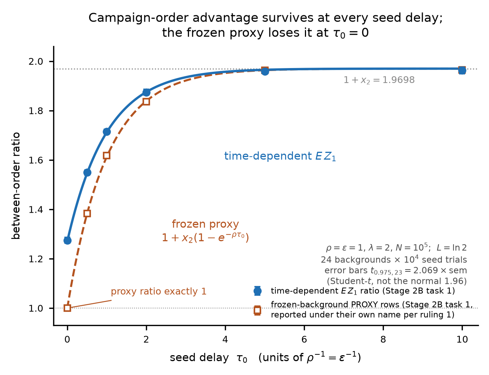
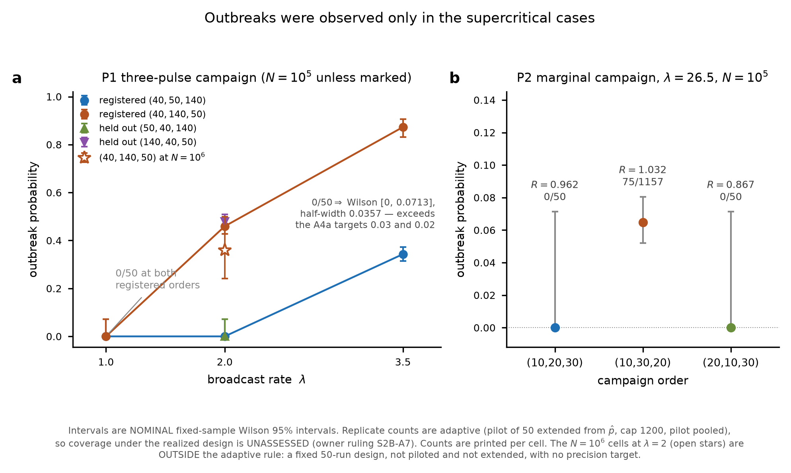
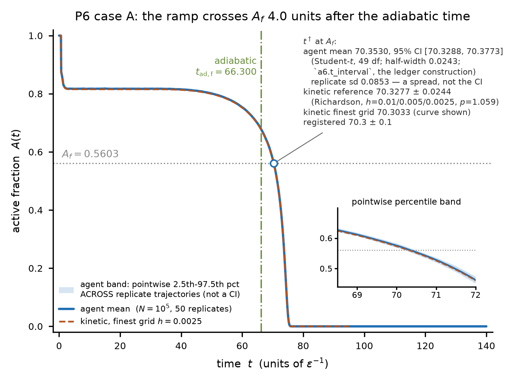
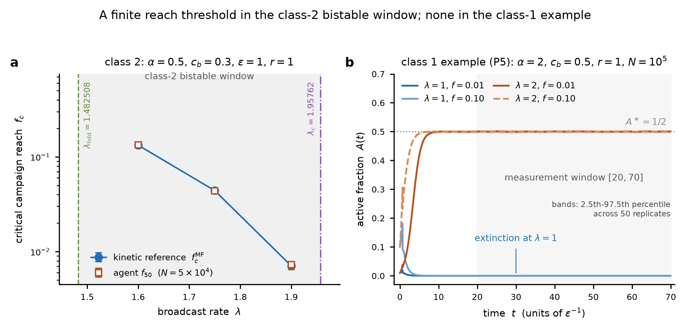

# Campaign order, stance memory and burn-out in promoted crowds

Oct 1, 2026 · @Robert Brunner

**Draft status.** Revision 2. Numbers from RESULTS\_LEDGER.md (262 rows: 218 PASS, 2 FAIL, 3 INCONCLUSIVE, 38 reported without a verdict, 1 withdrawn). P10 withdrawn; Appendix B carries no numerical certification. Figures 1–4 inserted, generated from the certified archives.

## 1. Introduction

A promotional campaign that activates nobody can still decide whether a crowd later catches fire. In the process studied here, three framings at 40°, 50° and 140°, delivered once to every member of a silent population, leave its mean stance at x = 0 in one order and at x = 0.970 in another. No agent is active at any point. After relaxation every agent sits at T\_s with zero conviction, so the dependence of orientation and conviction on the campaign conditional on stance has gone; the unconditional orientation law keeps the difference, because then E\[cos 2φ\] = x. The invasion number of a single active seed placed in the relaxed population is 0.347λ in the first case and 0.683λ in the second, a factor of 1.970, and full finite-N simulations measure 0.347327λ and 0.682419λ.

The process is a mean-field stochastic crowd in which each agent carries an orientation, a decaying conviction, a binary stance and an exposure counter for each framing class. Messages update orientation by the two-dimensional projective response rule of the question-order literature (Wang and Busemeyer 2013; Wang et al. 2014), deposit conviction scaled by a novelty weight r raised to the number of prior exposures in that class, and set stance by a hysteresis rule. An agent talks only while its conviction exceeds a gate c\_b, so the crowd's own broadcasting is endogenous: it starts when a campaign or a peer pushes conviction past the gate and stops when decay brings it back. Harras and Sornette (2011) drive agents with random news and let them adapt their trust in sources; here the external source is a prescribed campaign that stops, and everything after it is the crowd talking to itself.

With r < 1 and finitely many framings, each listener's conviction budget is finite in every framing class, total activity is bounded, and the crowd goes silent without any scheduled event (Theorem 1). That invasion and eventual extinction coexist is already true of the Kermack–McKendrick epidemic; the content here is the budget per listener and per class. On a relaxed background the next-generation operator depends on the population only through x and the clock parameters, so campaign order reaches the asymptotic invasion threshold only through the stance law it leaves behind (Theorem 2). The spectral-radius criterion is standard (Diekmann, Heesterbeek and Roberts 2010); the contribution is the operator for this process. Two further order channels, the prepared orientation and the correlation between outcome and deposit, relax at rates ρ and ε, the first permanent only at ρ = κ = 0 (Proposition 2 and Section 4.3). At r = 1 the onset of self-sustained activity falls into the three classes of Dodds and Watts (2004, 2005); the new element is the clipped two-receipt coefficient G(α) and the boundary ℓ = √G(α) between backward and locally forward onset (Theorem 3). In the class-1 sector with α ≥ 1 there is no finite ignition threshold in campaign reach (Proposition 5), and one class-2 example with backward onset has one (Proposition 6); no classification of ignition thresholds by onset class is claimed. For a habituating crowd one kinetic comparison puts the time at which activity first falls below a frozen-law fold activity, t† = 70.3277 ± 0.024 in the kinetic reference, 4.02 time units (5.7 % of t†) after the frozen-law adiabatic fold time (Proposition 4). The projective rule predicts that the probability of giving the same answer to two framings Δ apart is cos²Δ in either order and from any starting law, the rank-one, two-dimensional case of the QQ equality, and a classical automaton that stores its last framing and last outcome reproduces every joint law of the process (Proposition 8).

Every conclusion concerns a specified stochastic process and its limits. The numbers are closed-form or quadrature evaluations, solutions of the mean-field kinetic equation, or measurements from an exact event-driven simulation of the finite-N process; Section 8 gives the methods and Section 9 the certification rule. The certified record has 262 rows: 218 PASS, 2 FAIL and 3 INCONCLUSIVE verdicts, 38 quantities reported without a verdict, and 1 withdrawn row. Withdrawn and unverified registered values are identified where they occur.

## 2. Model

The process is specified below in full, with the three clarifications adopted before certification (Section 2.5). Every result in this paper is a statement about this process or about a named limit of it.

### 2.1 Agents

N agents. State: orientation φ\_i ∈ \[0°, 180°); conviction c\_i ∈ \[−1, 1\]; stance s\_i ∈ {+, −}; exposure counters n\_{i,j} ∈ ℕ per framing class j; campaign indicator u\_i ∈ {0, 1}. Parameters: ε > 0; 0 < c\_b < 1; 0 ≤ c\_h < c\_b; α, β ≥ 0; λ, ρ, κ ≥ 0; 0 < r ≤ 1; 0 < δ < 45°. Targets T\_+ = 0°, T\_− = 90°. The analytical statements hold for real angles and real δ; in the implemented model every angle, δ included, is an exact integer number of degrees (Section 2.5). The framing class of an angle θ is the basis {θ, θ + 90°}, keyed by θ mod 90°.

### 2.2 Clocks and delivery

Each agent carries independent Poisson clocks: broadcast at rate λ (active agents only), reset at rate ρ, reconsideration at rate κ. Clocks, recipient draws and acceptance coins are mutually independent. Campaign messages occur at prescribed pulse times and are not Poisson. When an active agent's broadcast clock rings, it sends its current orientation to one other agent chosen uniformly at random. In mean field the hazard of receiving a peer message is λA, with the orientation drawn from the active orientation distribution.

### 2.3 Message transition

A message at angle θ acts atomically, in this order:

1. Accept with probability cos²(θ − φ), setting φ ← θ; otherwise reject, setting φ ← θ + 90°.
2. n\_{j(θ)} ← n\_{j(θ)} + 1.
3. c ← c + r^{n\_{j(θ)} − 1} · cos 2θ · (+α if accepted, −β if rejected), with the post-increment counter.
4. Clip c to \[−1, 1\].
5. s ← + if c ≥ c\_h; s ← − if c ≤ −c\_h; s unchanged otherwise; the previous stance is retained at an exact tie.

Reset (rate ρ) sets φ ← T\_s. Reconsideration (rate κ) sets φ ← T\_s ± δ, each with probability ½. Neither changes c, s or the counters. Between events conviction decays as ċ = −εc. Counters never decrease. An agent broadcasts if and only if |c| > c\_b; silent agents receive.

### 2.4 Campaign and initial laws

The cohort is drawn once, with u\_i = 1 with probability f. A campaign is a finite list of pulses (t\_k, θ\_k), each applied once to every cohort member at t\_k. Coincident pulses compose in index order with no reset or reconsideration between them. Order comparisons hold the multiset of framings, the pulse times, the pulse count m and the reach f fixed.

Three initial laws are used. I1 (fresh-aligned): φ = T\_+, c = 0, s = +, n = 0. I2 (fresh-isotropic): φ uniform, c = 0, s = + unless declared, n = 0. I3 (stationary silent background at (ρ, κ) with stance law p\_+): c = 0; given s, φ = T\_s with probability ρ/(ρ + κ) and T\_s ± δ with probability κ/(2(ρ + κ)) each; counters declared. I3 requires ρ + κ > 0. At ρ = κ = 0 the clocks do not select a unique stationary orientation law, and the background must be declared. Statements of the extinction type require finitely many initial orientation classes.

### 2.5 Clarifications adopted for certification

Three readings of the specification text were fixed before the Stage 2 runs. First, the novelty weight on a receipt in class j is r raised to the number of prior exposures in that class, so a first receipt carries weight 1; this is the convention every derivation in the appendices uses, and it is what step 3 states. Second, orientations and framings are exact integer degrees, framing classes are integer identifiers allocated when an angle is created, and I2 is the uniform law on the 180 integer-degree rays of \[0°, 180°). Every registered quantity is unchanged by this choice, because every harmonic of order below 180 averages to zero on that grid. Third, the tie clause of step 5 applies only at c\_h = 0 with c = 0.

### 2.6 Limits, aggregates and labels

Mean-field statements take N → ∞ at fixed t, then t → ∞ when a long-time statement is made; the order is stated each time. At finite N, after any finite campaign, the population becomes silent almost surely, and every persistence statement in this paper is a mean-field statement. Invasion of I3 is decided by the spectral radius of a next-generation operator; on a prepared background that operator is time-inhomogeneous.

The aggregates are the active fraction A, the mean stance x = E\[s\], the active stance B = E\[s · 1(|c| > c\_b)\], and the ever-active fraction Z. The single-shot lifetimes are L = ε⁻¹ ln(1/c\_b), L\_α = ε⁻¹ ln(min(α, 1)/c\_b) for α > c\_b and L\_α = 0 for α ≤ c\_b (α = 0 included), and L\_β likewise. The expected unclipped increment of one message is

$$
E[\Delta c \mid \phi, \theta, n_j] = \frac{r^{n_j}\cos 2\theta}{2}\left[(\alpha-\beta) + (\alpha+\beta)\cos 2(\theta-\phi)\right].
$$

Each result carries one of four labels. EXACT: a consequence of the specification, obtained independently in two derivations that agree. LIMIT: valid under an explicit scaling whose order is stated. CLOSURE: valid under a named reduction. OPEN: not established. Where two derivations differ, the difference is stated with the result.

### 2.7 Three meanings of ignition

Activation is the campaign itself creating agents with |c| > c\_b. Invasion is linear growth of activity from an infinitesimal active seed in a declared background. Persistence is mean-field activity that stays positive as t → ∞. The three are logically independent here: the campaigns of Section 4 activate nobody and still decide invasion, and Section 3 shows that invasion can occur in a population that cannot persist.

### 2.8 Provenance

The orientation rule is the two-dimensional real projective (Lüders) response of the quantum question-order model of Wang and Busemeyer (2013) and Wang, Solloway, Shiffrin and Busemeyer (2014). Those papers also supply the sequential-overlap product of framings and the invariance of the maximally mixed state under projection, both used in Section 4. Conviction, stance, habituation through the counters, the activity gate and the campaign are additions made here. A classical automaton with outcome memory reproduces every prediction of the projective rule exactly (Section 6).

## 3. Extinction

A habituating crowd with finitely many framings has a finite conviction budget, and it spends that budget whatever it hears. The bound uses the counters and the decay and does not use the projective rule.

### 3.1 The finite-budget theorem

**Theorem 1 (R2; Appendix C §C2.0). \[EXACT\]** Assumptions: r < 1, finitely many reachable framing classes, finite initial conviction, and a finite campaign. For class j choose a representative angle θ\_j. The total absolute magnitude of all future unclipped deposits into one agent is bounded by

$$
V_\infty \le \sum_j \frac{\max(\alpha,\beta)\,|\cos 2\theta_j|\, r^{n_j(0)}}{1-r}.
$$

Clipping cannot increase the absolute size of a deposit's effect. Therefore

$$
|c(t)| \le |c(0)|e^{-\varepsilon t} + \int_0^t e^{-\varepsilon(t-s)}\,dV(s), \qquad V(\infty) < \infty,
$$

and the right side tends to zero. \[LIMIT; order N → ∞ at fixed time, then t → ∞.\] A(t) → 0, and

$$
\int_0^\infty A(t)\,dt \le \frac{E|c(0)| + E V_\infty}{\varepsilon c_b}.
$$

Stage 1 certifies the counter law the theorem rests on. Under a prescribed Poisson message input of known intensity Λ after one pulse, the counter law is 1 + Poisson(Λ): the measured counter mean is 7.001755 against 1 + Λ = 6.999728, with the 95 % interval on the difference \[−4.65 × 10⁻³, 8.71 × 10⁻³\] inside δ = 0.140, and the variance is 6.013486 against 5.999728, interval \[−7.43 × 10⁻³, 3.49 × 10⁻²\] inside δ = 0.120 (Stage 1, T3a; N = 10⁵, 10 replicates). Class identifiers agree with six hand-computed cases on all 37 checked quantities (T3b).

### 3.2 Scope and order of limits

The finite-class hypothesis is met by any finite campaign acting on finitely many initially active orientation classes, because the campaign, the reset and the reconsideration generate only finitely many classes. A continuously oriented initially silent population, I2 included, does not violate it: a message overwrites orientation before it creates activity. A continuously oriented initially active population does violate it (Appendix C §C2.0, EXACT). No stationary active branch exists for any 0 < r < 1, in one camp or two (Appendix C §C2(b) and §C4.3; Appendix D §C2(b) and §C4; LIMIT, mean field first). The order of limits decides the answer: fixed r < 1 followed by t → ∞ gives silence, while r → 1 taken first can give persistence, which Section 5 and Appendix A study at r = 1.

The integral bound separates invasion from persistence. A background can satisfy the invasion criterion of Section 4 and still go silent, because the bound caps the total activity any lineage can draw from it: positive linear invasion and eventual extinction coexist (Appendix C §C2.0, EXACT). An agent at state (c, n) in a one-camp crowd can never activate again once

$$
c + \frac{\alpha r^n}{1-r} \le c_b ,
$$

which is a sufficient permanent-silence test; its converse does not guarantee activation, because arrival timing and decay still matter (Appendix C eq. C2.20, EXACT).

### 3.3 Finite N

At finite N the population becomes silent almost surely after any finite campaign; this is part of the specification's limit structure (Section 2.6) and holds at r = 1 as well. On the r = 1 persistent branch extinction is slow already at small N. With the class-1 parameters of Proposition 5 at λ = 2, f = 0.5, no run out of 100 went extinct before T\_max = 2000 at any of N = 100, 200, 400 and 800, so the median extinction time exceeds 2000 at every N (supplement P8; censored, reported without verdict). No finite-N scaling law is claimed.

### 3.4 The stopwatch corner

The limit r → 0 at α = 1 isolates the budget in its simplest form: only the first exposure deposits conviction, and each first-exposed agent broadcasts for exactly L and is never refreshed.

**Proposition 1 (R6, first corner; Appendix C eq. C2.23, Appendix D §C2(d)). \[LIMIT; mean field first, then r ↓ 0 at fixed time; T-only optimism, α = 1, initial activating fraction f.\]** With S(t) the never-exposed fraction,

$$
S'(t) = -\lambda A(t) S(t), \qquad A(t) = f\,\mathbf 1_{\{t<L\}} + \int_{\max(0,t-L)}^{t} \lambda A(s) S(s)\,ds,
$$

the final size solves 1 − Z\_∞ = (1 − f) e^{−λLZ\_∞}, and invasion occurs if and only if λL > 1. This is the Kermack–McKendrick epidemic with a fixed infectious period, and it is not claimed as new.

The corner is certified at r = 10⁻⁶, c\_b = ½, where each first-exposed agent's active time lies in \[L, L₊\] with L₊ = ε⁻¹ ln(1/(c\_b − r/(1 − r))). At λ = 0 every one of 10⁵ lifetimes equals L = ln 2 to the last bit. Over 4 076 792 activated agents in two cells, no first active interval is shorter than L and no activity occurs after L₊, with L₊ − L = 2.0 × 10⁻⁶. The final size at λ = 3, f = 0.10 is Z = 0.844450 against 0.844578, interval on the difference \[−8.39 × 10⁻⁴, 5.83 × 10⁻⁴\] inside δ = 0.0422; at λ = 2, f = 0.30 it is 0.753861 against 0.753820, interval \[−1.11 × 10⁻³, 1.20 × 10⁻³\] inside δ = 0.0377 (Stage 1, T1; N = 10⁵, 20 replicates). The small-r approximation error, enclosed by solving the limiting equation at L and at L₊, is 1.16 × 10⁻⁶ and 1.13 × 10⁻⁶ in the two cells.

### 3.5 Relation to prior constructions

Wang, Tang, Zhang and Lai (2015) treat social reinforcement with recovery on networks through an edge-based rule that ignores redundant transmissions; their redundancy rule acts on edges, while the habituation here acts on the listener's framing class and shrinks every later deposit geometrically. Hashemi, Gallay and Hongler (2021) obtain collapse through a maturation delay; Theorem 1 needs no delay. Finite-resource extinction, the fixed-duration epidemic, and the coexistence of initial growth with eventual disappearance of activity (Kermack and McKendrick 1927) are standard. What Theorem 1 adds is narrower: the budget is set per listener and per framing class by the novelty weight.

## 4. Invasion and order

A silent background is invaded when the spectral radius of the next-generation operator, restricted to the types reachable from the seed, exceeds one. A seed's own first-generation count does not decide this: at α = 0.51, β = 0, c\_b = 0.5, ε = 1, λ = 2 in the positive target sector, a seed at conviction one has expected first-generation count 2 ln 2 = 1.386, while its offspring reproduce at 2 ln(0.51/0.5) = 0.0396. On a relaxed background the next-generation operator depends on the population only through its mean stance x and the clock parameters, so a campaign can move the invasion threshold only by moving x. Two orderings of the same three framings leave x = 0 and x = 0.970, activate nobody, and differ in invasion number by the factor 1.970.

### 4.1 The stationary next-generation operator

Theorem 2 and its corollaries assume I3, fresh counters in every reachable class, ρ, κ > 0, stance fraction p = p\_+ = (1 + x)/2, and linearization about zero activity (Appendix C §C3(a)). Put v = ρ + κ and ζ = (ρ + κ cos 2δ)/v.

**Theorem 2 (R7, general form; Appendix C eqs. C3.1–C3.4). \[EXACT\]** A message of angle θ is accepted by the background with probability

$$
p_{\rm acc}(\theta) = \frac{1 + \zeta x \cos 2\theta}{2}.
$$

With κ > 0 and current-orientation broadcasts, a T seed generates the finite angle set {0, δ, −δ, 90°, 90° + δ, 90° − δ}. Index a child type by b = (θ, o), with o acceptance or rejection; its post-message conviction is clip(α cos 2θ) on acceptance and clip(−β cos 2θ) on rejection, and only types with |c\*\_b| > c\_b are kept, with lifetime ℓ\_b = ε⁻¹ ln(|c\*\_b|/c\_b). A parent of type b that receives no further peer message at linear order has lifetime orientation occupation measure

$$
W_b(d\eta) = h_v(\ell_b)\,\delta_{\phi_b}(d\eta) + \left[\ell_b - h_v(\ell_b)\right]\pi_{s_b}(d\eta), \qquad h_v(\ell) = \frac{1-e^{-v\ell}}{v},
$$

where π\_s is the I3 orientation law given stance. The next-generation matrix and the criterion are

$$
K_{b',b} = \lambda\, W_b(\{\theta_{b'}\})\, p_{o_{b'}}(\theta_{b'}), \qquad R_{\rm inv} = \operatorname{spr}(K_{\rm reachable}),
$$

with the reachable restriction taken from the declared T seed. The stationary linearization is supercritical for R\_inv > 1, subcritical for R\_inv < 1 and critical at equality. Under the fresh-counter I3 declaration the background enters through x and (ρ, κ, δ) only; no framing-preparation product remains. Symmetries can remove the dependence on x for particular parameters, and nonfresh or stance-correlated counters require additional background information.

**Corollary 2a (R7, reduced form; Appendix C eqs. C3.5–C3.7, Appendix D §C3(a)). \[EXACT at κ = 0 in the target-aligned sector; no statement for κ > 0.\]** The operator reduces to rank 2, and with u = λL\_α, v = λL\_β, y = ζx,

$$
R_{\rm inv} = \tfrac12\left[u + \sqrt{u^2y^2 + v^2(1-y^2)}\right].
$$

The listener acceptance π₁ = (1 + ζx)/2 agrees exactly between the two derivations. For β ≤ c\_b the rejection block is unreachable from a T seed and R\_inv = λL\_α(1 + ζx)/2. For κ > 0 the closed form is not the criterion, and it is not the small-clock limit of the criterion either: the limit ℓ\_b(ρ + κ) → 0 does not commute with reachability, because every κ > 0 makes the off-target types reachable from the seed while κ = 0 removes them. A counterexample is the path ρ = h, κ = h², h → 0: along it ℓ\_b(ρ + κ) → 0 and κ/ρ → 0, yet every h > 0 makes the off-target blocks reachable, and when one of them has the larger spectral radius the seed-reachable radius tends to that block's value, not to the κ = 0 value. In the reduced form, when v > u the balanced background x = 0 is the easiest to invade.

Appendix D's four-type reduction keeps broadcasters at the exact targets, while Appendix C's operator lets parents reconsider and broadcast at T\_s ± δ; the reduced form is exact only where the two agree.

**Corollary 2b (used counters; Appendix E §C8(a)). \[EXACT, κ = 0\]** Split the background into the noncohort (mass μ₀ = 1 − f, counters n₀ = 0, stance law x₀) and the cohort (mass μ\_c = f, target-class counter n\_c = m\_T, stance law x\_c). With ℓ\_{αg} = ε⁻¹\[ln(min(1, α r^{n\_g})/c\_b)\]₊, ℓ\_{βg} likewise, a\_± = Σ\_g μ\_g p\_{g,±} ℓ\_{αg} and b\_± = Σ\_g μ\_g p\_{g,±} ℓ\_{βg}, the nonzero spectrum for target-aligned parents is that of λ\[\[a₊, b₊\], \[b₋, a₋\]\]; when both camp blocks are reachable

$$
R_{\rm inv} = \frac{\lambda}{2}\left[a_+ + a_- + \sqrt{(a_+-a_-)^2 + 4 b_+ b_-}\right],
$$

and when b₋ = 0 a positive T seed reaches only the positive block, with R\_inv = λa₊. A campaign that has used the target class makes accepted cohort offspring inactive once α r^{m\_T} ≤ c\_b; the whole cohort is unreachable only if also β r^{m\_T} ≤ c\_b.

**Corollary 2c (fast clocks; Appendix F §C8(c)). \[LIMIT (ρ + κ)ℓ\_b → ∞ for every reachable type\]** In that limit parents hold the I3 orientation law throughout life, and the orientation of a child born off target relaxes to the I3 law (T\_s or T\_s ± δ, not T\_s alone) on the timescale 1/(ρ + κ), so types reduce to stance. A parent of stance s broadcasts T\_s with weight ρ/v and T\_s ± δ with weight κ/v; with κ\_θ = 1 or cos 2δ for the two, π\_s(κ\_θ) = ½(1 + sζxκ\_θ), and the per-broadcast expected child lifetimes are

$$
a_s = \tfrac{\rho}{v}\,\pi_s(1)\,\ell(\alpha r^n) + \tfrac{\kappa}{v}\,\pi_s(\cos 2\delta)\,\ell(\alpha\cos 2\delta\, r^n),
\qquad
b_s = \tfrac{\rho}{v}\,[1-\pi_s(1)]\,\ell(\beta r^n) + \tfrac{\kappa}{v}\,[1-\pi_s(\cos 2\delta)]\,\ell(\beta\cos 2\delta\, r^n),
$$

with the matrix λ\[\[a₊, b₋\], \[b₊, a₋\]\] and R\_inv as in Corollary 2b; for β ≤ c\_b and a positive seed, R\_inv = λa₊. At κ = 0 this is Corollary 2b. Between the two regimes Appendix E gives the first-order correction in κ for an isolated simple dominant eigenvalue, with remainder bounded in column-sum norm by (2/3)λκ²L³ \[OPEN\]; the seed-reachable radius can jump at κ = 0 when a newly reachable block dominates, as under Corollary 2a: every κ > 0 makes the off-target types reachable from the seed, and κ = 0 removes them. At finite clock rates the occupation measure of Theorem 2 differs from its limit by W\_b − ℓ\_bπ\_{s\_b} = h\_v(ℓ\_b)(δ\_{φ\_b} − π\_{s\_b}), which is nonzero, and types with ℓ\_b → 0 need separate treatment.

### 4.2 Prepared backgrounds

A campaign leaves a background that is not I3, and that background relaxes. On it the linear birth measure obeys a nonautonomous renewal equation with a time-dependent birth kernel built from the no-seed background law (Appendix C eqs. C3.9–C3.10, EXACT). At κ = 0 the orientation law of a prepared agent relaxes as e^{−ρt}δ\_{φ₀} + (1 − e^{−ρt})δ\_{T\_s}, while its conviction decays as c₀e^{−εt}, and the correlations with c₀, s and n are retained (eq. C3.8, EXACT).

The expected first-generation count of a seed introduced at t₀, R₁(t₀) of eq. C3.11, follows the background as it relaxes during the seed's life. The frozen diagnostic R\_fr(t₀) = λℓ\_α q\_T(t₀) of eq. C3.13 evaluates the stationary formula on the background as it stands at t₀. In the relaxing-orientation special case with zero residual conviction and subthreshold β,

$$
R_1(t_0) = \lambda\left[p\,\ell_{\rm seed} + (q_T(0)-p)\,e^{-\rho t_0}\,\frac{1-e^{-\rho\ell_{\rm seed}}}{\rho}\right],
$$

and the two objects differ (Appendix C eqs. C3.12–C3.13, EXACT). Neither decides invasion. R₁(t₀) > 1 is in general neither necessary nor sufficient for asymptotic invasion (EXACT).

**Proposition 2 (R8, prepared backgrounds; Appendix C §C3(b), Appendix D §C3(b)). \[LIMIT; mean field, infinitesimal-seed linearization, then t → ∞\]** If the background converges to I3 and the seed has a nonzero path into the limiting reproductive class, the asymptotic threshold is the stationary threshold R\_inv(I3). Asymptotic growth is decided by the stationary operator, and the transient is governed by the nonautonomous renewal equation (C3.10). The prepared background cannot convert a subcritical I3 into invasion, because in the mean-field order an infinitesimal seed never leaves the linear regime in finite time. A seed that dies before reaching any reproducing class is an accessibility exception and cannot be rescued by a later supercritical background. At ρ = κ = 0 the orientation law never relaxes and the preparation is permanent, while deposits still relax at rate ε.

### 4.3 Three channels by which order reaches invasion

Order acts through three distinct parts of the post-campaign state. Each is isolated by one construction with f = 1, ε = 1 and an infinitesimal T-oriented seed at c = 1, s = + (Appendix C §C3(c), Appendix D §C3(c)).

**The stance channel, permanent under resets. \[EXACT after relaxation; Appendix C eq. C3.15, Appendix D §C3(c)(ii)\]** Take I2, α = 1, β = ¼, r = ½, c\_b = ½, c\_h = 0.01, κ = 0, ρ > 0, zero-gap campaigns, relaxed to I3. The 50° and 140° framings share a class, so the second receipt in that class carries half the novelty. Direct enumeration of outcomes gives p₊ = ½ for (40°, 50°, 140°) and p₊ = (1 + cos² 10°)/2 = 0.984923155 for (40°, 140°, 50°), so x = 0 and x = cos² 10° = 0.969846310. The campaign activates nobody: the largest post-campaign conviction is 0.37 < c\_b. After relaxation every agent sits at T\_s with c = 0, the accepted T dose has lifetime ln 2, the rejected dose is subthreshold, and Corollary 2a gives R\_inv = λ ln 2 · p₊ = 0.346573590λ and 0.682696708λ. The ratio is 1.969846310, carried by x alone. The invasion thresholds are λ = 2.885 and λ = 1.465.

The factor survives in the used-counter form through a single route (Appendix E §C8(b), EXACT). The campaigns leave counters n₄₀ = 1, n₅₀ = n₁₄₀ = 2 and n\_T = 0. Through either used basis the largest accepted single-shot magnitudes are 0.0868 and 0.0434, so a seed constrained to a used basis has reproduction number zero in both preparations. An active seed with ρ > 0 resets to T = 0°, whose class is fresh, and the ratio 1.969846310 is recovered through that reset route. At ρ = ε = 1 with seed conviction 1 the expected time a 40° seed spends broadcasting T is ln 2 − ½ = 0.193147, and the expected first-generation counts are 0.096573590λ and 0.190235130λ, in the same ratio.

The stance channel is certified (Stage 2, P1; N = 10⁵, 24 background realisations per order). Zero agents are activated by either campaign, and the largest post-campaign |c| is 0.369002. The measured post-campaign stance is x = 0.000598, interval on the difference \[−5.7 × 10⁻⁴, 1.77 × 10⁻³\] inside the absolute tolerance 0.01, and x = 0.970109, interval \[−1.3 × 10⁻⁴, 6.5 × 10⁻⁴\] inside δ = 0.0194. Single-seed offspring counts on the background saved after relaxation for 10/ρ give R/λ = 0.347327, interval \[−1.13 × 10⁻³, 2.64 × 10⁻³\] inside δ = 0.00693, and R/λ = 0.682419, interval \[−2.63 × 10⁻³, 2.07 × 10⁻³\] inside δ = 0.0137. The ratio of the two measured operator values is 1.965. Two further orders were held out: their stances were computed from the same enumeration and written to a sealed file before any simulation, giving x = 0 for (50°, 40°, 140°) and x = 0.969846310 for (140°, 40°, 50°). The measured values are x = −0.001032, interval \[−2.49 × 10⁻³, 4.3 × 10⁻⁴\], and x = 0.969685, interval \[−4.9 × 10⁻⁴, 1.7 × 10⁻⁴\], with R/λ = 0.347335 and 0.680675, both inside δ. All nine P1 rows pass.

**The orientation channel, permanent only at ρ = κ = 0 and only from non-isotropic starts. \[EXACT; Appendix C eq. C3.14, Appendix D §C3(c)(i)\]** Take I1, α = 1, β = 0, r = ½, c\_b = 0.95, ρ = κ = 0, pulse gaps ln 100. No pulse activates and every order leaves x = 1. With the sequential-overlap product Γ = cos 2θ₁ Π\_{k=2}^{3} cos 2(θ\_k − θ\_{k−1}), the acceptance of a T message is q\_T = (1 + Γ cos 2θ₃)/2 and R\_inv = λq\_T ln(1/0.95). The orders (10°, 20°, 30°), (10°, 30°, 20°) and (20°, 10°, 30°) give q\_T = 0.707442366, 0.759089355, 0.637858566 and R\_inv/λ = 0.036287050, 0.038936194, 0.032717867. From I2 the maximally mixed orientation is invariant under every projection and all orders give R\_inv/λ = 0.025646647.

The orientation channel is certified (Stage 2, P2; N = 10⁵, 20 realisations per order, 60 from I2). The measured acceptances are q\_T = 0.705763, 0.759274 and 0.638396, with R/λ = 0.036206, 0.039010 and 0.032654; every interval on the difference lies inside δ = 2 % of the prediction. From I2 all orders give R/λ = 0.025635, interval \[−1.6 × 10⁻⁴, 1.4 × 10⁻⁴\] inside δ = 5.1 × 10⁻⁴. At λ = 26.5, where the three orders have R = 0.962, 1.032 and 0.867, the measured outbreak probabilities are 0/50, 75/1157 = 0.065 and 0/50; the design registers no number for them, so they carry no verdict (Section 9.2). The delayed version of this check (P2-delay) gives two verdicts. At ρ = 0.5 the orientation difference between orders decays as e^{−ρτ₀}, with the largest absolute deviation over four delays 1.70 × 10⁻³, interval \[1.48 × 10⁻³, 1.91 × 10⁻³\] inside 0.02: PASS. At ρ = 0 the persistence of the spread across orders is INCONCLUSIVE at δ = 2 % of the τ₀ = 0 spread: the measured spread 0.006073 against 0.006199 has interval \[−5.4 × 10⁻⁴, 2.9 × 10⁻⁴\] on the difference against δ = 1.24 × 10⁻⁴, and resolution would need about 2.9 × 10⁵ replicates.

**The outcome–deposit channel, transient at rate ε even when orientation is frozen. \[Appendix C eqs. C3.16–C3.22, Appendix D §C3(c)(iii)\]** Take I2, α = 0.6, β = 0, c\_b = 0.5, ρ = κ = 0, zero gaps, seed introduced immediately. Order (45°, 20°) leaves (φ, c) = (20°, d) or (110°, 0) with probability ½ each, d = 0.6 cos 40° = 0.459627; order (20°, 45°) leaves four atoms at 45° and 135° (eq. C3.17). There the deposit is correlated with orientation, since P(c = d, φ = 45°) = ½cos²25° = 0.410697 against ¼ for independence, but both final orientations accept T with probability ½, so the deposit is independent of T-susceptibility. Both orders have x = 1 and unconditional T acceptance ½. In (45°, 20°) the deposit sits on exactly the agents that favour T. The frozen diagnostics are R\_fr(0) = 0.316695967λ and 0.218867184λ \[EXACT formulas, diagnostic only\]. The expected second-generation count from a seed introduced immediately, computed in the time-dependent kernel without freezing the background, is E Z₂ = 0.0976502474λ² and 0.0689974669λ² \[EXACT\]. Both orders share the asymptotic threshold R\_∞ = (λ/2) ln 1.2 = 0.091161λ \[LIMIT; mean field, linearization, then t → ∞\].

The outcome–deposit channel is certified at λ = 4 (Stage 2, P3; N = 10⁵, 20 realisations per cell). The frozen diagnostic, labelled as such, measures 1.260159 and 0.878210 against 1.266784 and 0.875469. E Z₂ from an immediate seed in the time-dependent kernel measures 1.561430 and 1.110392 against 1.562404 and 1.103959. At τ₀ = 10 both orders give 0.363536 and 0.362526 against R\_∞ = 0.364643. All seven rows pass at δ = 2 %.

A fourth construction shows that x alone does not order the transient. In the declared completion (iv\*) of Appendix C (I2, α = 0.45, β = 0.2, r = ½, c\_b = 0.95, c\_h = 0.01, ε = 1, κ = 0, three coincident pulses in the orders (T, T, 30°) and (T, 30°, T), ρ → ∞ after composition; §C.3.3), the order with the larger x, x = 0.1875, has the smaller frozen diagnostic, 0.014426λ against 0.019235λ, and in both orders all linear activity is gone by t = 0.1233 (eqs. C3.23–C3.25, EXACT kernel, LIMIT criterion). Stance decides the asymptotic threshold and does not decide the transient.

### 4.4 Seed delay

The order advantage is present at every seed delay. The delay experiment (P1-delay) introduces the seed at τ₀ ∈ {0, 0.5, 1, 2, 5, 10}/ρ after the two stance-channel campaigns at λ = 2 and measures, from single seeds on the saved background at each delay, the time-dependent first-generation count R₁(τ₀) of eq. C3.11 for each order. The reference is E Z₁(τ₀) = λ∫₀^L q\_T(τ₀ + s) ds \[EXACT formula; two independent evaluations agree to double precision, which is a consistency check, not an enclosure\]. At τ₀ρ = 0, 0.5, 1, 2, 5 and 10 the ratio of the second order's R₁ to the first's measures 1.27479 ± 0.00531, 1.54939 ± 0.00475, 1.71506 ± 0.00454, 1.87402 ± 0.00539, 1.95918 ± 0.00411 and 1.96282 ± 0.00624 (standard error over 24 backgrounds, 10⁴ trials each), against 1.2702501, 1.5455197, 1.7124792, 1.8751663, 1.9651325 and 1.9698145; the largest |z| over the twelve ratio rows of both estimands is 1.45 (Stage 2B). By Proposition 2 the long-delay limit is the stationary ratio 1.969846.

The frozen proxy is a different quantity: the ratio of frozen diagnostics R\_fr(τ₀) of eq. C3.13 evaluated on the background as it stands at each delay, which Stage 2 estimated. At these parameters its closed form is

$$
\frac{R_{\rm fr}^{(2)}(\tau_0)}{R_{\rm fr}^{(1)}(\tau_0)} = 1 + x_2\left(1 - e^{-\rho\tau_0}\right), \qquad x_2 = 0.969846310 .
$$

The frozen proxy measures orientation susceptibility on a frozen background, and invasion radii do not enter it. It equals 1 at τ₀ = 0 by construction, because the frozen diagnostic sees only the unrelaxed orientations, which give both orders T acceptance ½, since the maximally mixed I2 law is invariant under every projection; it rises with the relaxed fraction 1 − e^{−ρτ₀} and tends to 1.969846. The time-dependent R₁ follows the background as it relaxes during the seed's lifetime, which is why it exceeds 1 where the proxy does not. The Stage 2 measurements of the proxy:

| τ₀ ρ | ratio, measured (95 %) | 1 + x₂(1 − e^{−ρτ₀}) | unrelaxed fraction, measured | e^{−ρτ₀} |
| --- | --- | --- | --- | --- |
| 0 | 1.0006 \[0.9922, 1.0090\] | 1.000000 | 1.000000 | 1.000000 |
| 0.5 | 1.3836 \[1.3748, 1.3924\] | 1.381605 | 0.606686 | 0.606531 |
| 1 | 1.6177 \[1.6075, 1.6279\] | 1.613060 | 0.367975 | 0.367879 |
| 2 | 1.8359 \[1.8234, 1.8484\] | 1.838592 | 0.135510 | 0.135335 |
| 5 | 1.9639 \[1.9535, 1.9743\] | 1.963312 | 0.006703 | 0.006738 |
| 10 | 1.9651 \[1.9525, 1.9777\] | 1.969802 | 0.000046 | 0.000045 |

Stage 2 verdicts on the proxy: the τ₀ = 10/ρ value against 1.97 at δ = 2 %, PASS; the decay of the unrelaxed orientation fraction as e^{−ρτ₀}, largest deviation 1.65 × 10⁻³ against 0.02, PASS; the registered clause that the advantage exceeds 1 at every delay, INCONCLUSIVE on the proxy at τ₀ = 0, where the proxy is exactly 1. That verdict stands in the record; Stage 2B logs it as an estimand mismatch, and R₁ meets the clause at every delay.

**Figure 1.** Between-order ratio of the time-dependent first-generation count E Z₁, order (40°, 140°, 50°) to order (40°, 50°, 140°), against seed delay τ₀ in units of 1/ρ = 1/ε at λ = 2, N = 10⁵: measured points and the exact curve (Stage 2B, task 1). Error bars are t₀.₉₇₅,₂₃ = 2.069 times the standard error over 24 backgrounds of 10⁴ seed trials each. Open squares are the Stage 2B frozen-background proxy rows, reported under their own name, with the proxy 1 + x₂(1 − e^{−ρτ₀}) drawn on the same axes; it equals 1 at τ₀ = 0. Dotted line: the stationary ratio 1 + x₂ = 1.9698.

**Figure 2.** Outbreak probability (Section 9.1) by campaign order, reported without verdict, since no number is registered. Intervals are nominal fixed-sample Wilson 95 % intervals; the replicate counts are adaptive (Section 9.4), so their coverage under the realized design is not assessed. A 0/50 cell has interval \[0, 0.0713\], half-width 0.0357, which exceeds both precision targets. (a) P1 at N = 10⁵ and λ ∈ {1, 2, 3.5}, registered and held-out orders; the star marks 18/50 at N = 10⁶, λ = 2. The two N = 10⁶ cells used a fixed design of 50 runs, outside the adaptive rule, which would have required 984 replicates for 18/50. At λ = 2, where R = 0.693 and 1.365, order (40°, 50°, 140°) gives 0/50 and order (40°, 140°, 50°) gives 440/958 = 0.459 \[0.428, 0.491\]; the held-out orders give 0/50 and 504/1052 = 0.479 \[0.449, 0.509\]. At λ = 3.5 the two orders give 345/1006 = 0.343 \[0.314, 0.373\] and 275/315 = 0.873 \[0.832, 0.905\]. (b) P2 at λ = 26.5: 0/50, 75/1157 = 0.065 and 0/50 for R = 0.962, 1.032 and 0.867. Source: Stage 2.

### 4.5 Relation to prior constructions

Carro, Toral and San Miguel (2015) represent an external signal as direction-dependent herding coefficients, so the signal acts while it is present. Here the campaign is over before the seed arrives, and it acts only through the state it left. Niu, Shu and Zhao (2026) already connect a finite message-order preparation to later autonomous collective selection, so the general statement that order leaves a state that changes later collective behaviour is theirs. The claim here is limited to the gated invasion mechanism: the derived operator with endogenous broadcasting, the conviction gate and the per-class budget, and the separation of the stance channel from the transient orientation and outcome–deposit channels with their decay rates. Miller and Campbell (1959) established that the relative weight of first and last messages shifts with the delay before judgment. The stance channel is a delay-proof order effect: once the stance-conditional orientation and deposit traces have relaxed, the order survives in the stance law and, through it, in the relaxed orientation law.

## 5. Onset and burn-out

At r = 1 the crowd has stationary active states, and their onset falls into three classes set by the single-receipt dose α against the activity gate c\_b. At r < 1 the same crowd burns out. For one habituating crowd, activity first falls below the fold activity of a frozen-law approximation at t† = 70.3277 ± 0.024 in the kinetic reference, and the approximation's adiabatic fold time is 4.02 earlier, an adiabatic error of 5.7 %.

### 5.1 Onset at r = 1

Theorem 3 assumes r = 1, κ = 0 and the positive, target-aligned T-only sector, in which every agent has φ = T, s = + and receives only T messages, so that every receipt is an accepted positive dose α; and the stationary self-consistency A = M P\_{λA}, where P\_ν is the stationary probability that an agent driven at peer rate ν has c > c\_b. For the full I1 crowd M = 1; an equation with M < 1 requires a declared invariant responsive pool and a permanently nonresponsive remainder (Appendix C eq. C2.15, EXACT). The stationary conviction density for 0 < c < 1 is given by a method-of-steps quadrature with a clipped-arrival boundary flux, so P\_ν is an exact stationary quadrature (eqs. C2.11–C2.14, EXACT).

**Theorem 3 (R4; Appendix C §C2(b), Appendix D §C2(b)). \[EXACT; class 2 with clipping for all c\_b < α < 1, below\]**

Class 1, α ≥ 1. Every receipt refreshes conviction to one, P\_ν = 1 − e^{−νL} exactly, and P is concave. The onset is a forward transcritical bifurcation at λML = 1.

Class 2, c\_b < α < 1. The point A = 0 is transcritical at λML\_α = 1. With ℓ = ln(α/c\_b), the small-ν expansion in the unclipped regime is

$$
P_\nu = \frac{\nu}{\varepsilon}\,\ell + \Big(\frac{\nu}{\varepsilon}\Big)^2\left(\frac{\pi^2}{12} - \frac{\ell^2}{2}\right) + o\big((\nu/\varepsilon)^2\big),
$$

where π²/12 is the two-receipt accumulation volume and ℓ²/2 the overlap subtraction. The quadratic coefficient is positive whenever ℓ < √(π²/6) = 1.2825. The onset is then backward, with a fold below λ\_c = ε/(Mℓ) and hysteresis. At α = 0.4, c\_b = 0.39, ε = 1, M = 1: ℓ = 0.025318, λ\_c = 39.4979, and the coefficient is 0.822147 > 0.

Class 3, 0 < α ≤ c\_b. (At α = 0 no receipt deposits conviction and no positive branch exists.) With m ≥ 2 receipts needed, P = Θ(ν^m), the silent state is linearly stable for every λ, and the least λ with a positive fixed point is a saddle-node: the critical-mass case. Nondegeneracy and uniqueness of that minimum are additional properties, not consequences of the exponent alone.

The dichotomy "transcritical if and only if one receipt activates, saddle-node otherwise" is false: the class-2 example has a one-receipt dose and a critical-mass fold (Appendix C eq. C2.16, EXACT).

With clipping the class-2 expansion closes for every c\_b < α < 1 (derived independently twice; Appendix C §C.2.4; EXACT). After receipts at ages a\_old > a\_new the clipped conviction is min(e^{−a\_new}, α(e^{−a\_old} + e^{−a\_new})), so a two-receipt activation needs e^{−a\_new} > c\_b as well as the summed dose. The clip removes the set {u, v ≤ c\_b, u + v > c\_b/α}, whose du dv/(uv) measure is J(1/α) = Li₂(α) − Li₂(1 − α) + ln(1/α) ln((1 − α)/α), zero for α ≤ ½, and Euler reflection gives

$$
P_\nu = \frac{\nu}{\varepsilon}\,\ell + \frac{1}{2}\Big(\frac{\nu}{\varepsilon}\Big)^2\left[G(\alpha) - \ell^2\right] + O\big((\nu/\varepsilon)^3\big), \qquad G(\alpha) = \begin{cases} \pi^2/6, & \alpha \le \tfrac12, \\ \pi^2/3 - 2\,\mathrm{Li}_2(\alpha) - \ln^2\alpha, & \tfrac12 \le \alpha \le 1. \end{cases}
$$

G decreases from π²/6 to 0; G(1) = 0 returns the class-1 coefficient −L²/2, and G(½) = π²/6 returns eq. C2.16. The onset is locally backward if and only if ℓ < √G(α). Because ℓ increases and √G decreases in α, each c\_b has one α\*(c\_b) ∈ (c\_b, 1), with backward onset on (c\_b, α\*) and locally forward onset on (α\*, 1); a negative coefficient does not exclude a fold at larger A. At α = 0.8, √G = 1.044 and the backward window is c\_b > 0.282, against 0.222 from the unclipped boundary. The coefficient is 0.624994 at α = 0.75, c\_b = 0.74, despite clipping, and −0.138439 at α = 0.4, c\_b = 0.1, so class 2 is not backward throughout.

**Proposition 3 (R6, second corner; Appendix C eq. C2.24, Appendix D §C2(d)). \[EXACT, submodel\]** At r = 1, α = β = 1, κ = 0, in the invariant two-orientation population with conviction sign matching orientation and stance, every peer receipt resets |c| to one. After initial-condition effects have expired, A(t) = 1 − exp\[−λ∫\_{t−L}^{t} A(s) ds\], with stationary branch A\* = 1 − e^{−λLA\*}. With two fixed camps of total mass M the threshold is λML = 1 and x is inert. At λ = 2, L = ln 2 the branch is A\* = ½. Stage 1 certifies it: A\* = 0.500002, interval on the difference \[−2.07 × 10⁻⁴, 2.11 × 10⁻⁴\] inside δ = 0.025, with both camps fixed and zero violations (T2; N = 10⁵, 20 replicates).

Dodds and Watts (2004, 2005) found three onset classes in a dose-response contagion model with a finite memory window: epidemic, vanishing critical mass and pure critical mass. The classification, backward onset with hysteresis, and critical-mass ignition are theirs. Theorem 3 contributes the closed-form boundary of class 2 in a process with decaying, clipped conviction: the boundary ℓ = √G(α) between backward and locally forward onset for exponential memory with clipping; their class-II condition on the two-dose probability is the positive quadratic coefficient here.

The renewal equation of Proposition 3 is Eq. (1.8) of Cooke and Yorke (1973), B(t) = g\[X(t) + c\] with X(t) the integral of B over \[t − L, t\], taken at c = 0, g(y) = 1 − e^{−λy} and A in the role of B. Their constant solutions k = Lg(k), Eq. (6.15), give A\* = 1 − e^{−λLA\*} with k = LA\*, and their Theorem 2 gives convergence of every solution with bounded X to a constant. The match is at the level of the equation and not of the mechanism: their period L is counted from infection and their B is an incidence rate, while here every receipt restarts the period and A is the active fraction. Neither corner, nor the threshold of Proposition 5, which follows from the same equation, is claimed as new.

### 5.2 Burn-out of a habituating crowd

At r < 1 every receipt in a class shrinks the next deposit, so the dose an agent can still receive falls as the crowd talks. The minimal number of receipts that can activate an agent whose next dose is d = αrⁿ is the geometric count

$$
m_* = \min\left\{k \ge 1 : d\,\frac{1-r^k}{1-r} > c_b\right\},
$$

infinite when d/(1 − r) ≤ c\_b; for an agent with zero initial conviction, driven at constant input ν and observed at a fixed finite time t, the activation probability is C\_{m\*}(εt, d, r, c\_b)(ν/ε)^{m\*} + O((ν/ε)^{m\*+1}), where C\_{m\*} > 0 is the ordered-time integral of eq. C2.6 and the counter advances with every receipt (Appendix C eqs. C2.9–C2.10, Appendix D §C2(a), EXACT). The frozen-dose count ⌊c\_b/(αr^{n−1})⌋ + 1 is correct only at r = 1 and otherwise understates the exponent: at d = 0.4, r = 0.5, c\_b = 0.65 it gives 2, while three receipts are needed.

In the stochastic process the last active receipt index K\_last = sup{k : c\_k > c\_b} is a random variable with no common population value (Appendix C eq. C2.19, EXACT). In the fluid regime λM ≫ ε, where shot noise self-averages, the mean conviction obeys

$$
\bar c(t) = c_0 e^{-\varepsilon t} + \lambda M \alpha r^{m_0}\,\frac{e^{-gt} - e^{-\varepsilon t}}{\varepsilon - g}, \qquad g = (1-r)\lambda M,
$$

and collapse occurs when c̄ falls to c\_b, with closed-form collapse indices in the branches g < ε and g > ε and a residual-conviction factor (ε − g)/(λM) relative to the single-shot index (Appendix D §C2(c), CLOSURE). The crossover between the fluid and sparse regimes in closed form is OPEN.

After one pulse the counter law is exact: with H(t) = ∫₀ᵗ λA, n(t) = U + Poisson(H(t)), U \~ Bernoulli(f), and the remaining nominal dose budget is αB/(1 − r) with B(t) = E\[r^{n(t)}\] = (1 − f + fr)e^{−(1−r)H(t)} (Appendix E §C7(a), EXACT). Conviction and counter are correlated, and the full joint-law evolution, equivalent to the ordered-time quadrature with a self-consistent Volterra equation and a convergent Picard iteration, is the kinetic reference against which every approximation below is judged (Appendix C eqs. C2.6–C2.8, Appendix E §C7(d), EXACT).

Two approximations replace the joint law by an r = 1 stationary law evaluated at the current counter state. They are different constructions. In what follows a collapse marker is a declared activity level, not extinction.

The dose mixture (Appendix E). The joint law is compared with the mixture over counter values n, weighted by the exact counter law, of the r = 1 stationary conviction law at dose αrⁿ and the current intensity. Under a slow-intensity assumption, with Γ = ν\_max/ε and η = (1 − r)Γ, the Wasserstein distance between the two is O(η ln(1/η)) \[LIMIT\]; converting that distance into a bound on activity, proportional to its square root divided by the branch's stability margin γ, is not established \[OPEN\]. Neither the slow-intensity condition nor the branch neighbourhood follows from η ≪ 1 alone, and γ → 0 at a fold, so the estimate is not a uniform fold-time theorem \[OPEN\]. The mixture onset is backward precisely when the mixed quadratic coefficient q̄₂ is positive, and a crowd can have a backward mixture onset with no class-2 dose present: at c\_b = 0.6, α = 2.5, r = 0.4, f = 1 the doses are 1, 0.4, 0.16, …, the first class 1 and the rest class 3, and q̄₂ > 0 for H > 1.402830 \[EXACT; the r = 0.4 case is not a slow-habituation example\].

The frozen-rate bridge (Appendix F). F(Λ, ν; r) is the activation probability of an agent started at (c = 1, n = 1), driven at constant rate ν and read at time Λ/ν. Conditional on Λ the counter law is exactly 1 + Poisson(Λ) whatever the rate history, so F departs from the exact single-agent law only through the rate inside the memory window. The bridge is A = F(Λ, λA) with Λ̇ = λA. At ε = 1, α = 1, c\_b = 0.4, λ = 2.5 its error in A stays below 0.1η over the first 70 % of the run for η = 0.125, 0.25 and 0.5 \[LIMIT, verified numerically\]. At the collapse point the residual is 0.20, 0.25 and 0.30: the exact process reaches the bridge's fold carrying conviction built at the higher rate of the preceding window and overshoots it. Locating the collapse point by any quasi-static method is OPEN.

**Proposition 4 (fold comparison, case A; Appendix E §C7(c)). \[CLOSURE\]** Take α = 2, β = 0, r = 0.99, λ = 3, ε = 1, c\_b = 0.5, ρ = κ = 0, f = 1, one T pulse from I1, so c(0) = 1, n(0) = 1 and η = 0.03. On the dose-mixture branch the fold sits at activity A\_f = 0.5603318 and cumulative hazard H\_f = 158.354403, reached at the adiabatic time t\_ad,f = 66.30915. Two kinetic checks of the full joint law give the first downward crossing of A\_f at t† = 70.31256 and 70.25815 (C2 Picard quadrature), and an independent refined joint-law calculation gives 70.29963. Both comparisons satisfy |t\_ad,f − t†|/t† < 6 %, with no fitted offset.

The full finite-N process agrees with the kinetic solution (Stage 2, P6 case A; N = 10⁵, 50 replicates). The fold-activity crossing time t†, the first downward crossing of A\_f, measures 70.353 against the registered 70.3 ± 0.1, interval on the difference \[+0.029, +0.077\] inside δ = 5 % of the prediction, and Stage 2B's independent measure solver gives t† = 70.3277 ± 0.024. Against the kinetic reference t† = 70.3277 ± 0.024, for which the matched floor comparison from 10⁻² to 10⁻⁴ shifts t† by 1.4 × 10⁻⁴ and the step from the production floor 2 × 10⁻² to 10⁻² is not quantified (Section 8.2), the adiabatic fold time 66.30915 is earlier by 4.02, an adiabatic error of 5.7 %. At the crossing A = 0.5603, so more than half the crowd is still active: t† marks the passage of the approximation's fold activity, not extinction. This is one comparison of one approximation at one η; no delay law is claimed from it.

In case B, at α = 1, c\_b = 0.4, λ = 2.5, r = 0.95, f = 1, the kinetic solution crosses the declared trajectory marker A = 0.325 at t\* = 12.90546 ± 0.00305 with cumulative hazard Λ\* = 25.4286 ± 0.0134 (Stage 2B, counter-resolved measure solver, floor converged at c\_min = 10⁻⁴). The full process (N = 10⁵, 50 replicates) gives Λ\* = 25.43130 as the mean of replicate crossings and 25.43138 as the crossing of the mean trajectory, both inside δ = ±1.27142 (5 %); an N ladder from 2.5 × 10⁴ to 2 × 10⁵ extrapolates to 25.4289. The registered 25.4 is recovered at its stated precision. Appendix F's 25.38, obtained by simulation at M = 2 × 10⁴, differs from the kinetic value by 3.6 times its numerical uncertainty and remains unverified. The bridge-fold hazard 20.35 of Appendix F is a different object and is not compared with Λ\*.

**Figure 3.** P6 case A: agent mean A(t) (N = 10⁵, 50 replicates) with a band of pointwise 2.5th–97.5th percentiles across replicate trajectories, which is a spread, not a confidence interval, and the kinetic solution at the finest step h = 0.0025. The fold activity A\_f = 0.5603 and the adiabatic fold time t\_ad,f = 66.309 are marked. At A\_f the mean replicate crossing time is 70.3530, 95 % CI \[70.3288, 70.3773\] (Student-t, 49 df), and the mean trajectory crosses at 70.3529. The kinetic reference is 70.3277 ± 0.0244. Inset: the band at the crossing. Sources: Stage 2 P6, Stage 2B task 3 solver.

### 5.3 Finite-amplitude ignition

A finite threshold reach f\_c is a pulse size below which activity dies and above which the crowd reaches the persistent branch. The class-1 sector with α ≥ 1 has none (Proposition 5), and the class-2 backward example has one (Proposition 6). No general classification is claimed: a locally forward onset does not exclude a fold at larger A, and in class 3 the answer depends on the campaign family, since a single fresh subthreshold pulse activates nobody at any reach while repeated pulses can.

**Proposition 5 (class 1 has no threshold; Appendix E §C9(b)). \[EXACT; r = 1, α ≥ 1, positive T-only sector\]** With L = ε⁻¹ ln(1/c\_b) and R = λL, a fresh activating pulse of reach f gives A(t) = fe^{λt}/(1 − f + fe^{λt}) for 0 ≤ t < L and the renewal equation of Proposition 3 afterwards. For R > 1 every f > 0 converges to the unique positive A\* = 1 − e^{−RA\*}; for R ≤ 1, A(t) → 0 for every f ≤ 1. Hence f\_c = 0 for R > 1, as an infimum not attained, and no reach persists for R ≤ 1, although the pulse activates its recipients at every f > 0. The class-1 onset is certified at r = 1, α = 2, β = 0, c\_b = 0.5, I1, one pulse (P5): at λ = 2, where λL = 2 ln 2 > 1, the time-averaged activity over \[20, 70\] is A = 0.500118 at f = 0.01 and 0.499891 at f = 0.1, intervals on the difference from ½ of \[−3.4 × 10⁻⁵, 2.7 × 10⁻⁴\] and \[−2.6 × 10⁻⁴, 3.9 × 10⁻⁵\] inside δ = 0.025; at λ = 1, where λL = ln 2 < 1, activity is identically zero from t = 20 onward in every run at both reaches (N = 10⁵, 50 replicates per cell).

**Proposition 6 (class 2 backward; Appendix F §C9(b)). \[EXACT by two-step quadrature, eq. C2.13\]** At r = 1, α = 0.5, c\_b = 0.3, ε = 1, ℓ = ln(5/3) = 0.511 < √(π²/6), so the onset is backward. The stationary response gives λ(ν) = ν/P\_ν falling from λ\_c = 1.9576 as ν → 0 to λ\_fold = 1.482508 at ν\_f = 0.556791, A\_fold = 0.375574, then rising (Appendix F's 1.49 is corrected). The small-ν expansion reproduces the quadrature to 2 % at ν = 0.05 and 0.1, an independent check of the two-receipt coefficient. Near λ\_c the unstable branch follows from that expansion as A\_u = (1 − λℓ)/(λ²q₂), q₂ = ½(π²/6 − ℓ²) = 0.692 \[LIMIT, λ → λ\_c⁻\].

Stage 2 certifies the extinction below the fold and the upper branch (P4; N = 5 · 10⁴). Below the fold, at λ = 1.40, no reach ignites: zero runs with A(160) > 0 out of 500 at f ∈ {0.10, 0.25, 0.50, 0.75, 1.00}. On the upper branch A\* = 0.6364, 0.7472 and 0.8132 at λ = 1.60, 1.75 and 1.90 against 0.63, 0.75 and 0.81, every interval inside δ = 5 %.

The threshold reach is f\_c = 0.13268 ± 0.00093, 0.04407 ± 0.00048 and 0.00708 ± 0.00026 at λ = 1.60, 1.75 and 1.90 (discretization errors; floor converged at c\_min = 10⁻⁵), from a deterministic measure solver of the mean-field kinetic equation that shares no code with the agent simulator and reproduces the stationary quadrature of Theorem 3 to 1.8 × 10⁻⁶ (Stage 2B). The finite-agent 50 % points against realised reach at horizon t = 160 (Stage 2, N = 5 · 10⁴) are 0.133422 \[0.132588, 0.134220\], 0.043815 \[0.043361, 0.044434\] and 0.007310 \[0.006476, 0.007633\], overlapping the kinetic values at all three λ. f\_c falls toward zero as λ → λ\_c, and no reach ignites below λ\_fold. The values first registered, 0.127, 0.038 and 0.0086 from Appendix F's finite-agent simulation, are disjoint from the kinetic values at all three λ, and a persistence criterion at t = 40 does not recover them; the discrepancy lies in the registered prediction, and those values are withdrawn. So is Appendix F's prefactor 0.75 relating f\_c to the unstable branch A\_u: the kinetic ratio f\_c/A\_u is 0.942, 0.772 and 0.584 at the three λ and is not constant. The Stage 2 FAIL verdicts at λ = 1.75 and 1.90, and P4's rejection at adjusted p = 1.5 × 10⁻²⁴ (Section 9.5), are verdicts against those registered values and stand in the record.

**Figure 4.** (a) Class-2 backward onset (α = 0.5, c\_b = 0.3, r = 1): kinetic f\_c^MF with the agent f₅₀ overlaid at λ = 1.60, 1.75 and 1.90, with λ\_fold = 1.482508 and λ\_c = 1.9576 marked; below λ\_fold no reach ignites (0/500 runs at λ = 1.40). (b) Class-1 example (P5, α = 2): active fraction A(t) at λ = 1 and 2 for f = 0.01 and 0.10; activity dies at λ = 1 and settles at A\* = ½ at λ = 2, measured over \[20, 70\]; bands are pointwise 2.5th–97.5th percentiles across 50 replicates. Sources: Stage 2 P4, Stage 2B task 2, Stage 3 P5.

### 5.4 Finite-amplitude observables

A single campaign pulse produces a burst with a peak, a total and a duration, and in the stopwatch corner all three are enclosed between exact bounds.

**Proposition 7 (Appendix E §C9(a)). \[EXACT\]** Define A\_max = sup A(t), I = ∫₀^∞ A dt and T\_act = Leb{t : A(t) > A\_max/2}. Take α = 1, β = 0.4, r = 10⁻⁶, λ = 0.5, ε = 1, c\_b = 0.5, c\_h = 0.01, ρ = κ = 0, I1, one T pulse at zero. Every first T receipt sets conviction to one, later deposits total at most B = r/(1 − r), and each first-exposed agent is active throughout the first L = ln 2 of its age and never after L₊ = ln(1/(c\_b − B)). With Z\_D(f) solving 1 − Z\_D = (1 − f)e^{−λDZ\_D} and P\_D(f) = fe^{λD}/(1 − f + fe^{λD}),

$$
L Z_L \le I \le L_+ Z_{L_+}, \qquad P_L \le A_{\max} \le P_{L_+}, \qquad L \le T_{\rm act} \le L_+ .
$$

At f = 0.25: A\_max ∈ \[0.32037724, 0.32037746\], I ∈ \[0.22968922, 0.22969009\], T\_act ∈ \[0.69314718, 0.69314919\]. For two coincident pulses {T, T⊥}, order (T, T⊥) ends at c = 1 with n\_T = 2 and reproduces these enclosures, while order (T⊥, T) ends at c = β + αr = 0.400001 < c\_b and gives A\_max = I = T\_act = 0.

| f | A\_max | I | T\_act |
| --- | --- | --- | --- |
| 0.10 | 0.13580 | 0.09963 | 0.69315 |
| 0.25 | 0.32038 | 0.22969 | 0.69315 |
| 0.50 | 0.58579 | 0.41095 | 0.69315 |
| 0.75 | 0.80926 | 0.56233 | 0.69315 |

The full process is certified against this table (Stage 3, P7; N = 10⁵, 50 replicates per cell, δ = 2 %): all 36 rows pass, and no discrepancy exceeds 6.5 % of its tolerance. On the mean trajectory the measured values at f = 0.10, 0.25, 0.50 and 0.75 are A\_max = 0.135949, 0.320176, 0.585634 and 0.809615, I = 0.099760, 0.229582, 0.410795 and 0.562582, and T\_act = 0.693200 in every cell. T\_act has no replicate variation, because every cohort member shuts off inside a window of width 2 × 10⁻⁶; its numerical error is the grid quantization |0.6932 − ln 2| = 5.28 × 10⁻⁵. The coincident campaign (T, T⊥) reproduces the single-pulse values at every reach, largest difference 2.12 × 10⁻⁴, and (T⊥, T) gives A\_max = I = T\_act = 0 exactly, because no cohort member's conviction reaches c\_b.

## 6. What the response rule predicts

Given the framing angles, the projective response rule makes one prediction with no fitted coefficient about pairs of messages: the probability that an agent gives the same response to two framings separated by Δ is cos²Δ, in either order and from any initial orientation law. A classical automaton that remembers its last framing and last outcome reproduces every joint law of the process, so the prediction tests the cosine law and says nothing about how it is implemented. Applying it to real messages requires a mapping from messages to angles that is specified or estimated independently of the response data; the paper supplies none.

### 6.1 Cosine invariance

**Proposition 8 (same-outcome invariance). \[EXACT\]** Let an agent receive two messages at framings θ₁ and θ₂, Δ = θ₂ − θ₁, with no reset, reconsideration or other receipt between them. Then

$$
P(AA) + P(RR) = \cos^2\Delta
$$

for every initial orientation law and for both orders.

Proof. Step 1 of the message transition leaves the agent at φ = θ₁ after acceptance and at φ = θ₁ + 90° after rejection, whatever its prior orientation. From θ₁ the second message is accepted with probability cos²Δ; from θ₁ + 90° it is rejected with probability cos²Δ. Hence P(AA) + P(RR) = \[P(A₁) + P(R₁)\] cos²Δ = cos²Δ. ∎

The statement uses only the orientation update. Conviction, stance, counters and the gate do not enter, and the initial law drops out at the first message. It is the rank-one, two-dimensional case of the QQ equality of Wang, Solloway, Shiffrin and Busemeyer (2014), an elementary specialization rather than a new law. Boyer-Kassem, Duchêne and Guerci (2016) derive stronger reciprocity restrictions for nondegenerate projective models and report their failure on survey data, which bears on any behavioural reading of the rank-one rule. An outcome-conditioned classical kernel with an asymmetric acceptance law reproduces the qualitative order effects and fails the identity, so the identity tests the form of the rule. A population test needs both responses of each cohort member observed directly: silent agents do not broadcast, and a later broadcast can follow a reset, a reconsideration or another receipt. The repeated-framing lock is the case Δ = 0: P(AR) = P(RA) = 0 pathwise.

The identity is certified as an implementation check of the response rule (Stage 1, T4; N = 10⁵ agents per cell, 20 replicates). Coincident pulses at Δ ∈ {15°, 30°, 45°, 60°, 75°}, both orders, from I1 with the anchor aligned with θ₁, from I2, and from I3 at x = 0.6, give 30 process cells and 30 automaton cells. The largest discrepancy over all 60 is 5.94 × 10⁻⁴ (Δ = 60°, second order, I1, process), against δ = 3/√N = 9.49 × 10⁻³. The lock is certified on I2 with campaign (T, T) at α = 0.6, β = 0.2, r = 0.5, c\_h = 0.01, c\_b = 0.95, ε = 1, f = 1: P(AR) = P(RA) = 0 over 2 × 10⁶ agents for both process and automaton, final convictions exactly {−0.3, +0.9}, and x = 0.000526, interval \[−1.07 × 10⁻³, 2.13 × 10⁻³\] inside 0.01 (T5).

### 6.2 The automaton control

The classical outcome-memory automaton stores the last framing θ\_i and the last outcome, and accepts a new framing θ\_j with probability cos²(θ\_j − θ\_i) from the stored ray. Its state is a re-coordinatization of the orientation φ, so it agrees with the process pathwise under a shared random seed. This makes it an equivalence control exact by construction, reported and not tested statistically (Sections 8 and 9). Over 30 cells and 1.5 × 10⁷ agents on shared seeds, process and automaton show zero disagreements in the outcome pair, the final conviction, the stance and the counter vector.

Every result of Sections 3 to 5 is a statement about the process, and every one of them holds verbatim for the automaton. The projective rule enters as the cosine law and its consequence, repeatability of an outcome once realized. The geometry is the provenance of the rule (Section 2.8), not a mechanism the results require.

### 6.3 A contrast without outcome memory

The declared surrogate keeps an anchor a and a receptivity τ, updates τ ← τ cos 2(θ − a) and a ← θ on each receipt, draws its response with probability (1 + τ)/2 after the update with no outcome-dependent update, starts from the pure-state lift a₀ = φ₀, τ₀ = 1, and broadcasts at angle a (Appendix C §C.5). It is defined only at ρ = κ = 0: no reset or reconsideration rule is declared for (a, τ). In a prescribed-message experiment with no intervening operations it gives, for each single message, the same acceptance probability and the same mean orientation as the process started from the same orientation law; it differs in joint laws. Its same-outcome fraction is (1 + cos 2Δ · E\[τ₁²\])/2 with τ₁ = cos 2(θ₁ − a₀): cos²Δ from an anchor aligned with θ₁, and ½ + ¼ cos 2Δ from an isotropic anchor. The surrogate fails the cosine identity only from non-aligned initial laws. Stage 1 certifies both closed forms at all five Δ, largest discrepancy 4.36 × 10⁻⁴, and the 30 surrogate grid cells, largest discrepancy 9.34 × 10⁻⁴, all against δ = 9.49 × 10⁻³ (T6).

The absence of outcome memory shows in three joint-law quantities, all one property, repeatability of a realized outcome (Appendix C §C.5; EXACT under the declared surrogate). From I2 with (T, T) at the parameters of the lock test, the process leaves x = 0 and the surrogate x = ¼, while independent draws at acceptance ½ give x = ½; Stage 1 measures the surrogate at x = 0.250668, interval \[−9.2 × 10⁻⁴, 2.25 × 10⁻³\] inside 9.49 × 10⁻³, with P(AA) = P(RR) = 3/8 and P(AR) = P(RA) = 1/8 reproduced (T5). Because the stance laws differ, the two would give different T-acceptance after relaxation to the targets, ½ against 5/8, so the single-message equivalence does not extend to a process in which stance feeds back. In the outcome–deposit construction of Section 4.3, order (45°, 20°), the frozen diagnostic is 0.316696λ for the process against 0.239077λ for the surrogate, and E Z₂ is 0.0976502λ² against 0.0749168λ²; the two agree exactly in the other order. After a 60° framing from I1 (α = β = 0.2, r = 1, c\_h = 0.01, c\_b = 0.9, ε = 1, f = 1, campaign (0°, 60°, 60°)), a repeated rejection is locked in the process with probability ¾ and has probability 9/16 in the surrogate. The stance contrast and the repeated-rejection contrast do not decay: conviction decay, reset and reconsideration leave stance and the realized outcome history unchanged. Only the residual-conviction contribution to the frozen diagnostic and to E Z₂ decays, at rate ε, and process and surrogate share R\_∞ = (λ/2) ln 1.2 in that construction.

The surrogate rows are certified as implementation checks of the surrogate; the process-versus-surrogate differences in invasion quantities are derived and have not been run against the process (registered as a control for P3; not among the certified rows).

### 6.4 Relation to prior constructions

The question-order effect and its projective account are those of Wang and Busemeyer (2013) and Wang, Solloway, Shiffrin and Busemeyer (2014), and the invariance of the maximally mixed state belongs to that literature. Chu (2026) places that account on a network with a Lindblad master equation: each agent carries a density matrix, survey questions are non-commuting projectors under the Lüders rule, and the product-state reduction recovers the Friedkin–Johnsen model, with coherence decaying as e^{−t/2} independently of the network and order effects decaying with it to an opinion-determined residual. The construction here differs at the agent: every receipt collapses the orientation onto a ray, so no coherence is carried between messages, the conviction gate makes the dynamics nonlinear, and order reaches the population threshold through the stance law. Mutlu and Özmen Garibay (2021) add interference terms with fitted phases to an edge-based threshold contagion model and calibrate them against simulation; the response rule here has no phase parameter, and its two-message prediction cos²Δ is fixed. Chu's model already combines projective question-order operations with network opinion dynamics; the distinction claimed here is the gated invasion mechanism, not the combination. The cosine identity is not claimed as a new law: the crowd model inherits it from the response rule, and a classical outcome-memory automaton satisfies it exactly.

## 7. Discussion and open problems

The paper's hardest test is the stance channel against delay. The two campaigns of Section 4.3 differ by a factor 1.970 in invasion number on the relaxed background, and that factor is carried by the stance law after the stance-conditional orientation and conviction traces of the campaign have gone. The certified operator values on the relaxed background, 0.347327λ and 0.682419λ, confirm the stationary statement, and the sealed held-out orders confirm the enumeration that predicts x. At finite delay the time-dependent first-generation ratio is above 1 at every delay tested, including a seed placed at the end of the campaign, where the frozen proxy is exactly 1.

The finite budget (Theorem 1), the stationary operator (Theorem 2), the used-counter operator (Corollary 2b), the three onset classes in the positive target sector (Theorem 3) and the cosine invariance (Proposition 8) are exact; the reduced and fast-clock forms (Corollaries 2a and 2c) are limits. The prepared-background statement (Proposition 2) is a limit with a stated order. The fold comparison (Proposition 4) is a closure checked in one case. Four problems remain open, and each would change a statement in the paper if closed.

A uniform fold-time theorem. The conditional tracking bound of Section 5.2 controls the bulk of a habituating trajectory at order η ln(1/η), but its stability margin vanishes at the fold, and the slow-intensity assumption does not follow from η ≪ 1 (Appendix E §C7(a), OPEN). The frozen-rate bridge tracks the bulk below 0.1η and misses the collapse point by a residual that does not scale linearly with η (Appendix F, OPEN). Closing either needs fold-passage asymptotics or a two-variable scheme with the cumulative hazard and an exponentially averaged rate. Until then the paper states one kinetic comparison of a frozen-law fold, case A, and no delay law. Whether the traversal of onset classes by a habituating crowd survives once the frozen-rate law replaces the dose mixture is part of the same problem (Appendix F, OPEN).

The threshold near the fold. Proposition 6 fixes λ\_c and λ\_fold, the near-λ\_c form of the unstable branch follows from the two-receipt expansion, and the kinetic reference gives f\_c at λ = 1.60, 1.75 and 1.90. On (λ\_fold, 1.6) neither f\_c nor its prefactor is derived (Appendix F, OPEN).

Ignition at finite N or finite seed. In the mean-field order a prepared background cannot convert a subcritical I3 into invasion (Proposition 2). A finite seed or a finite population could leave the linear regime before the background relaxes. That route is outside the specification's mean-field statements and needs a large-deviation or finite-N calculation (OPEN). It is the one route by which campaign preparation could set persistence rather than transient gain.

The gated O(h) correction. The coefficient map of Appendix B is derived under an all-active reduction, and an all-active stationary population is impossible at finite h (Appendix C eq. C6.19, EXACT). The full gated correction, with activity conditioning, clipping and the boundary layers, and the skewness coefficient of the reduced switching law are OPEN.

Two further items are open at lower rank: the exact two-camp tails with clipping and the coexistence boundary beyond the fluid closure (Appendix A), and the crossover between the fluid and sparse collapse regimes in closed form (Section 5.2).

## 8. Methods

### 8.1 Event-driven simulator of the finite-N process

The simulator advances the finite-N process event by event and contains no approximation of it. Four event types share one binary min-heap: a broadcast at rate λ for each active agent, a reset at rate ρ, a reconsideration at rate κ, and the deterministic shut-off of activity at t + ε⁻¹ ln(|c|/c\_b). Every change of an agent's conviction pushes a fresh shut-off deadline with a new version number, and superseded entries are discarded when popped, so no step can pass a deadline. An agent that rises above c\_b from silence draws a fresh exponential broadcast time; an agent that falls to or below c\_b at a message loses its pending broadcast; an agent that stays active keeps its pending broadcast, which is exact by memorylessness.

Campaign pulses are prescribed-time impulses held outside the heap and take priority at exact ties. Pulses sharing a time are applied atomically in index order, so no reset or reconsideration can fall between coincident pulses. A hand case at κ = 1000, δ = 30° checks this: an interposed reconsideration would give P(AR | A) = sin²30° = ¼, and the measured P(AR) = P(RA) = 0 over 10⁵ agents while about 10⁶ reconsiderations fire after the pulses.

Conviction decays analytically between events, and clipping is applied at deposits only. The message transition follows the order of Section 2.3. Framing classes are integer identifiers allocated when an angle is created from the declared integer-degree angles; θ, θ + 90° and θ + 180° share an identifier, and the class is propagated from the incoming message rather than recomputed. Each broadcast goes to one other agent drawn uniformly, so the finite-N receiving hazard is λ(active others)/(N − 1), the source of the finite-N bias reported in Section 9.

The process, the outcome-memory automaton (state: last framing and last outcome; acceptance cos²(θ\_j − θ\_i)) and the surrogate of Section 6.3 run under one engine and differ only in the acceptance rule and the memory update.

For the invasion tests the engine adds five optional capabilities, each with a default that reproduces the base engine: saving and resuming the full state at each seed delay, with the time origin reset (exact, since the clocks are memoryless and the decay is multiplicative); injecting a seed at φ = T₊, c = 1, s = + with fresh counters; tracking generations, so that the seed is generation 0 and an agent activated by a generation-g broadcaster is generation g + 1; frozen-background operator checks, in which each recipient responds in its saved state while each activated agent's own conviction still decays, and every touched agent is restored after each trial; and the same check with the background decayed analytically to the message time instead of frozen, which is exact for a background that has received nothing. Re-running the full Stage 1 suite on the extended engine reproduces all 124 Stage 1 rows exactly.

Random numbers come from xoshiro256++ seeded by splitmix64. Each run seed is derived from a master seed (20261001 for Stage 1; 20261002 for Stage 2 and 2B; 20261003, 20261004, 20261005 and 20261006 for P5, P7, P9 and P8), and each run draws six independent streams by role: clocks, recipient draws, acceptance coins, cohort, initial law, and prescribed exogenous input. Changing the replicate count of one role does not shift another role's numbers. Environment: Python 3.12.14, numpy 2.5.3, scipy 1.18.1, numba 0.67.0.

### 8.2 Kinetic references

The ordered-time quadrature (eq. C2.6) with mean-field feedback a(t) = λA(t) is iterated to a fixed point (eq. C2.8); truncation after K receipts has error at most Pr{Poisson(H(t)) > K} (eq. C2.7). This method produced the case-A values 70.31256, 70.25815 and 70.29963 of Proposition 4, which are reported without error estimates.

The kinetic references are computed by a deterministic solver of the mean-field measure equation. It shares no code with the agent simulator: there is no event queue, no random number generator and no representation of an agent. At r = 1 the framing counters are inert, and with dose d = α the law obeys

$$
\frac{d}{dt}\langle\psi,\mu_t\rangle = \big\langle -\varepsilon c\,\psi'(c) + \lambda A(t)\,[\psi(\min\{1,c+d\}) - \psi(c)],\ \mu_t\big\rangle, \qquad A(t) = \mu_t((c_b,1]), \qquad \mu_0 = (1-f)\,\delta_0 + f\,\delta_{\min(1,\alpha)}.
$$

At r < 1 the counter is resolved. The state is (c, n), a receipt in slab n deposits d\_n = αrⁿ with n the pre-receipt count, and

$$
\frac{d}{dt}\langle\psi,\mu_t^{(n)}\rangle = \langle -\varepsilon c\,\psi',\mu_t^{(n)}\rangle - \lambda A(t)\langle\psi,\mu_t^{(n)}\rangle + \lambda A(t)\langle\psi(\min\{1,\cdot+d_{n-1}\}),\mu_t^{(n-1)}\rangle, \qquad A(t) = \sum_n \mu_t^{(n)}((c_b,1]).
$$

An optional constant drive replaces λA(t) by a prescribed ν, and the long-time activity is then the stationary response P\_ν of eqs. C2.11–C2.14.

**Grid.** The conviction grid is uniform in u = ln c on \[ln c\_min, 0\], because in that variable the decay ċ = −εc becomes the uniform translation u̇ = −ε. For a requested step h the solver sets U = −ln c\_min and J = round(U/h) and resets h ← U/J, so that the grid fits the interval exactly; the reported h is this adjusted value. The grid has J + 1 edges, the top one at c = 1. Mass is piecewise constant in u within a cell, so the activity counts the exact fraction of each cell lying above c\_b, and no cell is counted all or nothing.

**Time step and substeps.** The time step is tied to the grid, dt = h/ε. Each step consists of two full-length passes of the same composition, a jump substep of duration dt followed by a transport substep of duration dt. The first pass runs at ν = λA(t) from a copy of the state and is discarded after the predicted activity A\_pred is read off; the state is restored and the second pass runs at the averaged rate ½(λA(t) + λA\_pred) and is kept. Under a prescribed constant ν the first pass is skipped. Each transport substep moves the measure by exactly one cell, h in u, which is exactly εdt of decay, so the drift substep itself introduces no interpolation and no numerical diffusion.

**Error budget.** Composing the jump and transport substeps in a fixed order is a first-order Lie–Trotter splitting with an O(dt) commutator error, and the top-cell projection at c = 1 (see Boundaries) also contributes at O(dt). The ladders measure the two together and do not separate them; their combined first-order error dominates.

| source | order | status |
| --- | --- | --- |
| operator splitting (jump, then transport) and top-cell projection | O(dt) = O(h/ε) | dominant; combined, measured together by every h-ladder |
| deposit interpolation (conservative, linear in u) | O(h²) in position, exact in mass | subdominant |
| Heun step on the coupling rate | O(dt²) in the rate | subdominant |
| truncation of the jump series at K | O((ν dt)^{K+1}) | 9.4 × 10⁻¹¹ at K = 3 |
| transport | exact | — |
| conviction floor c\_min | O(c\_min), independent of h | laddered separately |

Every ladder below has observed order between 1.00 and 1.06, the combined first-order term and nothing faster. A second-order (Strang) composition was not used; the first-order rate is measured and extrapolated away.

**Jump map.** The jump substep applies the pure-jump semigroup exp(ν dt (J − I)), truncated after K terms of its exponential series, so the error of several receipts within one step is of order (ν dt)^{K+1}. All production runs use K = 3; over K = 3, 6 and 10, P\_ν changes by 9.4 × 10⁻¹¹ at every floor tested. K is the truncation order of this series, not a bound on conviction or on the counter. Deposits are placed by conservative linear interpolation in u between the two neighbouring cells, which conserves mass exactly. At r = 1 one counter slab represents the joint law exactly. At r < 1 there is one slab per counter value, ⌊λT + 8√max(λT, 1) + 16⌋ slabs in all, eight standard deviations above the bound λT on the Poisson counter; the mass that would pass the last slab is between 6.8 × 10⁻⁵⁹ and 1.5 × 10⁻⁵⁷ in the production runs.

**Boundaries.** The top edge of the grid is exactly c = 1, and the specification's clip is applied exactly to the deposit position, p ← min(p, 1). The clipped mass is then placed entirely in the top cell, c ∈ \[e^{−h}, 1\], not held as an atom at c = 1, so its later decay below that cell runs early by at most one time step. The top cell lies wholly above c\_b in every run here, so the projection does not affect A at the moment of deposition; its early decay can affect later activity, and it is part of the combined O(dt) error. Mass transported out of the lowest cell is pooled into an atom at c = 0, which has zero drift and receives deposits through its own interpolation weights, so floor mass is promoted correctly when it receives. The pooling makes a position error bounded by c\_min, the only error in the scheme that does not depend on h. The initial law counts the campaign pulse as the cohort's first receipt: the cohort starts at min(1, α) with counter 1 and the rest at c = 0 with counter 0. The mass deficit over the production ladders runs from 9.2 × 10⁻⁵ at the coarsest grid to 1.5 × 10⁻⁶ at the finest.

**Refinement and error reporting.** Three parameters are refined independently, and their contributions are reported separately. The step h is halved; the observed order is p = log₂|d\_n/d\_{n+1}| from consecutive differences, the reported value is the first-order Richardson extrapolation v\_∞ = v\_last + (v\_last − v\_prev), and the reported discretization error is the last Richardson increment |v\_last − v\_prev|. The horizon T is doubled (120 against 240 for the P4 basin boundary; 30, 60 and 120 for the stationary P\_ν), and where the quantity belongs to the flow rather than the window this is zero to all printed digits. The floor c\_min is laddered separately, because its error does not depend on h: refining h removes the discretization error and leaves the floor error untouched, so an h-ladder alone converges to a biased limit while reporting a small Richardson increment. Changing c\_min also changes U and therefore the adjusted h, so floor comparisons are made at matched adjusted h; c\_min = 10⁻² against 10⁻⁴ gives U₂/U₁ = 2 exactly, hence J₂ = 2J₁ and identical h.

**Convergence ladders.** In each table diff is v(h) − v(2h) and p the observed order.

P4 basin boundary f\_c^MF (α = 0.5, c\_b = 0.3, r = 1, T = 120, floor 10⁻³ as run):

| λ | h | f\_c | diff | p |
| --- | --- | --- | --- | --- |
| 1.60 | 0.008 | 0.14032707 | — | — |
|  | 0.004 | 0.13648692 | −3.840 × 10⁻³ | — |
|  | 0.002 | 0.13460228 | −1.885 × 10⁻³ | 1.027 |
|  | 0.001 | 0.13366797 | −9.343 × 10⁻⁴ | 1.012 |
|  | Richardson | 0.13273366 | error 9.34 × 10⁻⁴ |  |
| 1.75 | 0.008 | 0.04801910 | — | — |
|  | 0.004 | 0.04604016 | −1.979 × 10⁻³ | — |
|  | 0.002 | 0.04506484 | −9.753 × 10⁻⁴ | 1.021 |
|  | 0.001 | 0.04458089 | −4.840 × 10⁻⁴ | 1.011 |
|  | Richardson | 0.04409694 | error 4.84 × 10⁻⁴ |  |
| 1.90 | 0.008 | 0.00921832 | — | — |
|  | 0.004 | 0.00814185 | −1.076 × 10⁻³ | — |
|  | 0.002 | 0.00761507 | −5.268 × 10⁻⁴ | 1.031 |
|  | 0.001 | 0.00735457 | −2.605 × 10⁻⁴ | 1.016 |
|  | Richardson | 0.00709407 | error 2.61 × 10⁻⁴ |  |

The floor correction below replaces these limits by 0.13268101, 0.04406947 and 0.00708210; it does not depend on h and leaves every diff and every p unchanged.

P6 case A, t† at A\_f = 0.5603 (α = 2, r = 0.99, λ = 3, c\_b = 0.5, T = 95, floor 2 × 10⁻², 436 slabs):

| h | t† | diff | p |
| --- | --- | --- | --- |
| 0.0100052 | 70.228247 | — | — |
| 0.0050026 | 70.278978 | +5.073 × 10⁻² | — |
| 0.0024997 | 70.303333 | +2.435 × 10⁻² | 1.059 |
| Richardson | 70.327688 | error 0.024355 |  |

P6 case B, t\* and Λ\* at A = 0.325 (α = 1, r = 0.95, λ = 2.5, c\_b = 0.4, T = 40, floor 10⁻², 196 slabs):

| h | t\* | diff | p | Λ\* | diff | p |
| --- | --- | --- | --- | --- | --- | --- |
| 0.00998952 | 12.856209 | — | — | 25.211074 | — | — |
| 0.00500018 | 12.880884 | +2.468 × 10⁻² | — | 25.320462 | +1.094 × 10⁻¹ | — |
| 0.00250009 | 12.893164 | +1.228 × 10⁻² | 1.007 | 25.374649 | +5.419 × 10⁻² | 1.013 |
| 0.00125005 | 12.899282 | +6.118 × 10⁻³ | 1.005 | 25.401612 | +2.696 × 10⁻² | 1.007 |
| 0.00062502 | 12.902335 | +3.053 × 10⁻³ | 1.003 | 25.415049 | +1.344 × 10⁻² | 1.005 |
| Richardson | 12.905389 | error 0.003053 |  | 25.428485 | error 0.013437 |  |

**Floor audit.** Every certified kinetic reference has been floor-laddered.

- P4, run at c\_min = 10⁻³: lowering the floor to 10⁻⁵ shifts f\_c^MF by −5.26 × 10⁻⁵, −2.75 × 10⁻⁵ and −1.20 × 10⁻⁵ at λ = 1.60, 1.75 and 1.90. Each shift is independent of h to 5.6 × 10⁻¹⁷, and the residual floor error is at most 1.5 × 10⁻⁶.
- Case B, run at c\_min = 10⁻²: lowering the floor shifts t\* by +6.9 × 10⁻⁵ and Λ\* by +1.2 × 10⁻⁴, giving t\* = 12.905457 and Λ\* = 25.428608, and the residual from 10⁻³ to 10⁻⁴ is below 10⁻⁷.
- Case A, run at c\_min = 2 × 10⁻²: the matched comparison from 10⁻² to 10⁻⁴ shifts t† by 1.4 × 10⁻⁴, 0.6 % of the discretization error. The step from the production floor 2 × 10⁻² to 10⁻² is not commensurate with the matched construction and is not quantified; no corrected value is issued.

No verdict changes. The corrected f\_c^MF still overlaps the agent f₅₀ interval and remains disjoint from the withdrawn registered values at all three λ, and both case-B agent estimands still pass against the corrected Λ\*.

**Basin classifier.** The critical reach f\_c is the boundary between the extinction and ignition basins, located by bisection on f. At r = 1 the mean-field flow has two attractors, A = 0 and the upper branch A\*(λ), separated by the unstable middle branch, so the classifier uses that structure rather than an absolute cut on A. A trajectory ignites if A(T) > ½A\*(λ), dies if A(T) < ½A\_fold and A(T) ≤ A(T − dt), and is otherwise unclassified, in which case the run stops with an error instead of being assigned to a basin. The thresholds are the registered values A\*(1.60) = 0.6366173, A\*(1.75) = 0.7471937, A\*(1.90) = 0.8133804 and A\_fold = 0.3755739. Bisection stops when the bracket is narrower than 10⁻⁶; the reported f\_c is the bracket midpoint, with half-widths of 2.6 × 10⁻⁷ to 4.3 × 10⁻⁷.

With these settings the solver gives f\_c^MF = 0.13268 ± 0.00093, 0.04407 ± 0.00048 and 0.00708 ± 0.00026; case A t† = 70.3277 ± 0.024, the finest step alone giving 70.3033; and case B t\* = 12.90546 ± 0.00305 and Λ\* = 25.4286 ± 0.0134. The ± is the discretization error.

Stationary response functions are computed by the method of steps (eqs. C2.13–C2.14 and C4.1–C4.2). For α = 0.5 the clipped density needs two steps, on (0, ½) and (½, 1), and the fold of Proposition 6 follows exactly from that two-step quadrature: λ\_fold = 1.482508, ν\_f = 0.556791, A\_fold = 0.375574, with λ\_c = 1/ln(5/3) = 1.9576.

The fold quadrature removes both endpoint singularities exactly before any numerical rule is applied. With a = ν/ε and dose ½, the density is C c^{a−1} on (0, ½) and C c^{a−1}\[1 − a J(c)\] on (½, 1), where J(c) is the integral of u^{−a}(u − ½)^{a−1} over ½ < u < c. The substitution u = ½ + (c − ½)s^{1/a} removes the singular factor in J, the substitution t = y^{1/(a+1)} removes the residual t^a, and Gauss–Legendre quadrature of the smooth remainder reaches machine precision. The numerical errors are 1.0 × 10⁻¹¹ in λ\_fold, 1.7 × 10⁻⁹ in ν\_f and 1.1 × 10⁻⁹ in A\_fold, and A\_fold − ν\_f/λ\_fold = −5.6 × 10⁻¹⁷. At 100, 200, 400, 800 and 1600 nodes ν\_f is 0.556791435, 0.556791433, 0.556791421, 0.556791424 and 0.556791422. The two-receipt series of eq. C2.16 differs from the quadrature by relative amounts 1.6 × 10⁻¹⁰, 1.7 × 10⁻⁸ and 1.7 × 10⁻⁶ at ν = 10⁻⁵, 10⁻⁴ and 10⁻³, the relative difference scaling as ν², consistent with an absolute O(ν³) remainder.

## 9. Certification protocol

### 9.1 Estimands

Every registered quantity is one of three kinds. Operator checks measure offspring counts, types and generation timing of single seeds on a saved or frozen background and compare them with the kernel or branching calculation. Population checks measure outbreak probabilities and trajectories of the full finite-N process. Trajectory markers are crossing times and plateau values. Reproduction numbers, growth rates and outbreak probabilities are kept distinct, and a growth rate is never used to estimate a reproduction number; frozen diagnostics are labelled as such.

An outbreak is a run in which the ever-active fraction, excluding the seed and any agent the campaign itself activated, exceeds 1 % of N within t = 50/ε. In the seeded tests of Section 4 the campaign activates nobody, so the count is every ever-active agent other than the seed. Other horizons: the P4 extinction criterion is A(160) = 0 for every reach tested; P5 averages A over \[20, 70\] conditional on A(20) > 0, and its extinction rows require A(t) = 0 for all t ≥ 20 in every run.

### 9.2 Pass rule

For each quantity a tolerance δ is declared before the run: 2 % of the prediction for operator checks, 5 % for trajectory markers, ±0.03 absolute for outbreak probabilities when a number is predicted, 0.01 absolute for x = 0, and 10⁻³ for zero predictions of A\_max, I and T\_act; a pathwise zero fails on any violation. With d = measured − predicted, a row PASSES if the 95 % interval on d lies inside \[−δ, δ\], FAILS if it lies outside, and is INCONCLUSIVE otherwise, in which case the replicate count needed to resolve it is reported. Where no number is predicted, the precision target is not a tolerance and the row carries no verdict.

### 9.3 Intervals, independence and error sources

Operator rows use Student-t intervals across independent background realisations; each realisation is an independent run, and the 10⁴ single-seed trials on it are averaged before the interval is formed. Pooled proportions use fixed-sample Wilson intervals computed on all replicates, pilot runs included; their coverage under the adaptive design of Section 9.4 has not been assessed. Threshold-crossing estimators (P4 f\_c and the P2-delay spreads) use a 4000-draw bootstrap; P7 uses a 2000-draw percentile bootstrap over replicate traces. Four error sources are reported separately on every row and never absorbed into the verdict: Monte Carlo error, finite-N bias from an N ladder, numerical error of the reference calculation, and closure error, which is nonzero only for the adiabatic comparison of Proposition 4.

### 9.4 Replicate counts and stopping

Replicate counts are fixed before each run. For outbreak probabilities a pilot of 50 replicates gives p̂, and the replicate count is need = ⌈(1.96/target)² max(p̂(1 − p̂), v₀)⌉, then min(max(need, 50), 1200), with target 0.03 and variance floor v₀ = 0.01 for P1 and target 0.02 and v₀ = 0.004 for P2. The multiplier is the normal 1.96 and p̂(1 − p̂) the normal-approximation variance, although the interval reported is Wilson. The pilot is pooled into the reported estimate, so the final count depends on the data, which is why the denominators in Figure 2 differ; the cap of 1200 never bound, the largest count being 1157. At p̂ = 0 the rule gives 43 for P1 and 39 for P2, both below the pilot, so a 0/50 cell is never extended and misses the target by construction, with Wilson interval \[0, 0.0713\] and half-width 0.0357: P1 at λ = 1 for both orders, P1 at λ = 2 for orders (40°, 50°, 140°) and (50°, 40°, 140°), and P2 for orders (10°, 20°, 30°) and (20°, 10°, 30°). Because need is set from the pilot's p̂, the extended P1 cells at 440/958, 504/1052 and 275/315 also end slightly above the target, with Wilson half-widths 0.031, 0.030 and 0.037. The two N = 10⁶ cells at λ = 2 (0/50 and 18/50) are an exception to the rule: they used a fixed design of 50 runs, whereas the adaptive rule would have required 984 replicates for 18/50, and their Wilson half-widths are 0.036 and 0.129. No parameter is tuned after a FAIL, and INCONCLUSIVE rows are reported with the replicates required, not extended.

### 9.5 Multiple testing

The primary endpoints are P1, P1-delay, P2, P3, P4 and P6; the rest are secondary. For each primary endpoint the row p-values for the composite null |d| ≤ δ are Bonferroni-adjusted for the number of registered rows in that endpoint, and the endpoint p-value is the smallest adjusted row value. Holm's procedure is then applied across the six endpoints at family level 0.05. Only P4 rejects, at adjusted p = 1.5 × 10⁻²⁴.

### 9.6 Sealed predictions and discrepancy categories

The stances of the two held-out P1 orders were computed and written to a sealed file before any simulation. Discrepancies are assigned to one of four categories: implementation bug, error in the registered prediction, model failure, and estimand mismatch. Corrections are versioned and the original results retained. The record contains one prediction error (P4 f\_c; registered values withdrawn), one estimand mismatch (the P1-delay clause measured on the frozen proxy), and one unverified registered reference (case B, 25.38). Two harness defects were corrected before certification: rows emitted without intervals in the first Stage 2 version, and, in Stage 2B, a right-rectangle quadrature for Λ and a coarse sampling grid. One reference computation was corrected after certification: a fold located inside the measure solver at conviction floor c\_min = 10⁻³ carried an h-independent bias of 1.5 × 10⁻⁴ in ν\_f, which the h-ladder could not detect; it is logged as an implementation defect in a reference calculation (BUGLOG S2B-4), and the fold is now taken from the exact two-step quadrature.

## Figures and data sources

Figures 1–4 were generated by Claude for Science from the certified archives listed.

- Figure 1. R₁ ratio: the Stage 2B P1-delay rows (results ledger, Stage 2B). Frozen-background proxy rows: Stage 2B task 1. No inset.
- Figure 2. stage2/outputs/stage2\_results.json, entries reported\_diagnostics → P1 and P2 → outbreak\_probability; per-run data in stage2/outputs/raw/p1\_outbreak.csv and p2\_outbreak.csv.
- Figure 3. stage2/outputs/raw/p6.csv; kinetic trajectory from the Stage 2B measure solver output (stage2b/outputs/raw).
- Figure 4. Panel a: stage2b/outputs/p4\_comparison.csv and stage2/outputs/raw/p4.csv. Panel b: stage3/P5/outputs/certified\_table.csv.

## Acknowledgments

We thank an anonymous reader for counterexamples and checks.

## References

Boyer-Kassem, T., Duchêne, S. and Guerci, E. (2016). Testing quantum-like models of judgment for question order effect. Mathematical Social Sciences 80, 33–46.

Carro, A., Toral, R. and San Miguel, M. (2015). Markets, herding and response to external information. PLoS ONE 10(7), e0133287. doi:10.1371/journal.pone.0133287.

Chu, W. (2026). A quantum model of opinion dynamics on networks. arXiv:2607.01452v2.

Cooke, K. L. and Yorke, J. A. (1973). Some equations modelling growth processes and gonorrhea epidemics. Mathematical Biosciences 16, 75–101.

Diekmann, O., Heesterbeek, J. A. P. and Roberts, M. G. (2010). The construction of next-generation matrices for compartmental epidemic models. Journal of the Royal Society Interface 7, 873–885.

Dodds, P. S. and Watts, D. J. (2004). Universal behavior in a generalized model of contagion. Physical Review Letters 92, 218701.

Dodds, P. S. and Watts, D. J. (2005). A generalized model of social and biological contagion. Journal of Theoretical Biology 232, 587–604.

Gilbert, E. N. and Pollak, H. O. (1960). Amplitude distribution of shot noise. Bell System Technical Journal 39, 333–350.

Harras, G. and Sornette, D. (2011). How to grow a bubble: a model of myopic adapting agents. Journal of Economic Behavior and Organization 80(1), 137–152.

Hashemi, F., Gallay, O. and Hongler, M.-O. (2021). Opinion formation dynamics: swift collective disillusionment triggered by unmet expectations. Physica A, 125797. doi:10.1016/j.physa.2021.125797.

Henkel, C. (2016). An agent behavior based model for diffusion price processes with application to phase transition and oscillations. arXiv:1606.08269.

Kermack, W. O. and McKendrick, A. G. (1927). A contribution to the mathematical theory of epidemics. Proceedings of the Royal Society of London A 115, 700–721.

Krause, S. M. and Bornholdt, S. (2013). Spin models as microfoundation of macroscopic market models. Physica A 392(18), 4048–4054. doi:10.1016/j.physa.2013.04.044.

Lux, T. (1995). Herd behaviour, bubbles and crashes. Economic Journal 105, 881–896.

Miller, N. and Campbell, D. T. (1959). Recency and primacy in persuasion as a function of the timing of speeches and measurements. Journal of Abnormal and Social Psychology 59, 1–9.

Mutlu, E. C. and Özmen Garibay, O. (2021). Quantum contagion: a quantum-like approach for the analysis of social contagion dynamics with heterogeneous adoption thresholds. Entropy 23, 538.

Niu, R., Shu, X. and Zhao, Y. (2026). Message order selects opposite collective opinions on Laplacian-cospectral networks. arXiv:2608.20704.

Wang, W., Tang, M., Zhang, H.-F. and Lai, Y.-C. (2015). Dynamics of social contagions with memory of nonredundant information. Physical Review E 92, 012820.

Wang, Z. and Busemeyer, J. R. (2013). A quantum question order model supported by empirical tests of an a priori and precise prediction. Topics in Cognitive Science 5, 689–710.

Wang, Z., Solloway, T., Shiffrin, R. M. and Busemeyer, J. R. (2014). Context effects produced by question orders reveal quantum nature of human judgments. Proceedings of the National Academy of Sciences 111, 9431–9436.

## Appendix A. Two-camp dynamics (R9)

With two fixed camps at r = 1 and κ = 0, the stationary active states solve a cooperative two-dimensional fixed-point problem, and the negative camp is active on every positive branch whenever β > 0. All statements assume r = 1, κ = 0 and an invariant two-camp law: a positive camp at φ = 0, s = +, c ≥ 0, of mass p = M₊, and a negative camp at φ = 90°, s = −, c ≤ 0, of mass 1 − p = M₋. Reset leaves this law invariant (Appendix C §C4.1).

Jump rates \[EXACT\]. Positive agents receive magnitude-α reinforcement at rate λA₊ and magnitude-β reinforcement at rate λA₋; negative agents receive magnitude-α at rate λA₋ and magnitude-β at rate λA₊. A rejected T⊥ message therefore refreshes a positive agent by +β.

Stationary response \[EXACT\]. Let F(u, v; α, β) be the stationary probability that y = |c| exceeds c\_b for the capped process with jumps α at rate u, jumps β at rate v and decay −εy. Its density satisfies

$$
0 = \varepsilon(yf)' - (u+v)f(y) + u\,\mathbf 1_{\{y>\alpha\}} f(y-\alpha) + v\,\mathbf 1_{\{y>\beta\}} f(y-\beta),
$$

with clipped-arrival boundary flux

$$
\varepsilon f(1^-) = u\int_{\max(0,1-\alpha)}^{1} f(y)\,dy + v\int_{\max(0,1-\beta)}^{1} f(y)\,dy,
$$

and normalization with method-of-steps integration determines F (eqs. C4.1–C4.2). In the unclipped case the Laplace transform is explicit: E\[e^{−sc}\] = exp{−(λ/ε)\[A₊ Ein(sα) + A₋ Ein(sβ)\]} for the positive camp, with α and β exchanged for the negative camp, where Ein(y) is the integral of (1 − e^{−u})/u from 0 to y (Appendix C §C.4). This is the stationary amplitude law of Poisson shot noise with exponential decay (Gilbert and Pollak 1960); clipping and the self-consistency in A₊ and A₋ are the additions.

**Proposition A1 (no sharp skeptic threshold; eqs. C4.3–C4.5). \[EXACT\]** For every β > 0 and λA₊ > 0, a sufficiently tight cluster of rejected T messages carries a negative agent past c\_b with positive probability, and long gaps also have positive probability, so 0 < F(0, λA₊; α, β) < 1. Negative-camp activity is a smooth function of forcing. The mean-field threshold λβA₊ > εc\_b replaces random conviction by its unclipped stationary mean and is not an activation threshold of the process \[CLOSURE\].

**Proposition A2 (fixed points and branches; eqs. C4.6–C4.7). \[EXACT; N → ∞ before the stationary analysis\]** The stationary marginal equations are A₊ = pF(λA₊, λA₋; α, β) and A₋ = (1 − p)F(λA₋, λA₊; α, β). If 0 < p < 1 and β > 0, every positive fixed point has A₊ > 0 and A₋ > 0; if β = 0 a one-camp branch is possible. With ν = λ(A₊ + A₋), z = A₊/(A₊ + A₋), F₊ = F(νz, ν(1 − z)), F₋ = F(ν(1 − z), νz) and S = pF₊ + (1 − p)F₋, every positive branch is given by

$$
z = \frac{pF_+}{S}, \qquad \lambda = \frac{\nu}{S}, \qquad (A_+, A_-) = (pF_+, (1-p)F_-).
$$

**Proposition A3 (monotonicity and stability; eqs. C4.8–C4.11). \[EXACT\]** The response functions are nondecreasing in both arguments, so the fixed-point map of Proposition A2 is monotone on \[0, p\] × \[0, 1 − p\]. A least and a greatest fixed point exist, and fixed-point iteration from the extremal data (0, 0) and (p, 1 − p) converges monotonically to them. Fixed points need not be totally ordered: at α = 1, β = 0, p = ½, ε = 1, c\_b = ½, λ = 4 the camps decouple, each satisfies A = ½(1 − e^{−4 ln 2 · A}) with roots 0 and ¼, and (¼, 0) and (0, ¼) are incomparable fixed points. The linearized activity equation is a convolution equation with nonnegative response kernels k\_ij, and with the static susceptibility matrix J = λ diag(p, 1 − p) ∫₀^∞ k(t) dt, spr(J) < 1 implies linear stability and spr(J) > 1 linear instability; at equality a zero-frequency marginal mode requires nonlinear terms. No claim is made about which fixed point a given campaign selects.

**Proposition A4 (α = β = 1; eq. C4.12). \[EXACT\]** Total activity A = A₊ + A₋ obeys A = 1 − e^{−λLA}, with A₊ = pA and A₋ = (1 − p)A. A unique positive branch exists exactly when λL > 1, and it is stable because λL(1 − A) < 1. The negative camp is active whenever the positive camp is, and x = M₊ − M₋ is inert. This is Proposition 3 with a two-camp composition.

**Proposition A5 (fluid closure; Appendix D §C4). \[CLOSURE, λA ≫ ε\]** Replacing each camp's conviction by its fluid mean, c̄₊ = λ(αA₊ + βA₋)/ε and c̄₋ = −λ(βA₊ + αA₋)/ε, the fixed point (M₊, 0) exists if and only if λαM₊ > εc\_b and λβM₊ ≤ εc\_b; coexistence (M₊, M₋) exists if and only if λ(βM₊ + αM₋) > εc\_b and λ(αM₊ + βM₋) > εc\_b; and the negative camp has a hysteresis band εc\_b/λ ∈ (βM₊, βM₊ + αM₋), because active negative agents reinforce one another with −α.

**Proposition A6 (r < 1). \[LIMIT; N → ∞ first, then t → ∞\]** T and T⊥ share one class counter, so each camp's broadcasts habituate the other, both budgets α/(1 − r) and β/(1 − r) are finite, and Theorem 1 applies: no positive two-camp branch survives (Appendix C §C4.3, Appendix D §C4).

OPEN: a closed classification of every fold and degenerate point for arbitrary (α, β, c\_b, p); the exact stationary tails with clipping; the coexistence boundary beyond the fluid closure. The fixed points of Proposition A2 are certified at α = 1, β = 0.4, M₊ = M₋ = ½ (supplement P9; N = 10⁵, 50 replicates per cell). The symmetric branch measures A₊ = 0.298978 and A₋ = 0.299075 against 0.299029 at λ = 1.5; 0.423584 and 0.424215 against 0.423896 at λ = 2; and 0.482888 and 0.483186 against 0.483042 at λ = 3, every interval inside δ = 5 %. After perturbations of ±0.05 in either camp the activity returns to the branch within δ = 0.001 at all three λ, and pathwise no stance flips and no orientation leaves {T₊, T₋}, as the invariant two-camp law requires. All 18 rows pass.

## Appendix B. The Lux coefficient map (R10)

In a fast-message, weak-deposit scaling at r = 1, the conviction of an active agent becomes a reflected diffusion with stance-dependent drift, and the mean stance obeys the two-state switching law of Lux (1995) with coefficients mapped from the process parameters. The switching form is generic; the map and its domain are the content.

**Scaling and order. \[LIMIT\]** r = 1, active branch, current-framing broadcasts; α = h a₀, β = h b₀, λ = Λ/h², ρ = p₀/h, κ = k₀/h; h → 0 at fixed K = (H − ε/2)/D, then K → ∞, with exponent error O(hK). Define

$$
\bar a_0 = \frac{a_0+b_0}{2},\quad d_0 = \frac{a_0-b_0}{2},\quad v_0 = p_0 + k_0,\quad U = p_0 + k_0\cos 2\delta,\quad q = \frac{p_0 + k_0\cos^2 2\delta}{v_0}.
$$

**Proposition B1 (coefficient map; Appendix C eqs. C6.5–C6.7, Appendix D §C6(a)). \[CLOSURE: all-active bulk reduction, A = 1, slow stance frozen while the fast orientation process is averaged, away from clipping and switching boundary layers; then LIMIT in the order above\]** The orientation process multiplies its conditional first moment by q at each peer message, E\[Y\_nY\_{n+k}\] = q^{k+1} for Y = cos 2φ, and the drift and diffusion of conviction are

$$
H = \frac{\bar a_0\, q\, U}{1-q}, \qquad J = \frac{d_0\, U}{1-q}, \qquad D = \frac{\Lambda A q}{2}\left[d_0^2 + \bar a_0^2\,\frac{1+q}{1-q}\right],
$$

giving dc = (Hs − εc + Jx) dt + √(2D) dW, with s under the declared hysteresis rule. H and J are independent of the active fraction at leading order, because message rate and message-driven relaxation cancel, while D ∝ A (Appendix D §C6(a)).

The map needs q < 1, and q < 1 requires κ, δ > 0: with endpoint bases only the drift is O(1/h) and no diffusion limit exists. It also needs U > 0 and d₀ > 0. The wells must be wall-pinned: at c\_h = 0, x = 0 the potential V(c) = εc²/2 − H|c| has its minima at the walls only when H > ε; H > ε/2 merely makes H − ε/2 positive. At nonzero x both wells stay pinned only if H − |Jx| > ε, and H − J > ε suffices for all |x| ≤ 1 (eqs. C6.8–C6.9, CLOSURE). These conditions do not by themselves imply the ordered branch.

**Proposition B2 (tilt and switching law; eqs. C6.10–C6.13, Appendix D §C6(a)). \[CLOSURE for the barrier; LIMIT for the large-barrier reduction\]** For a positive stance persisting down to −c\_h, the exit barrier is B₊(x) = H(1 + c\_h) − (ε/2)(1 − c\_h²) + Jx(1 + c\_h), and the switching exponent is linear in x: with a = J/D, the hysteresis tilt is a\_hyst = (1 + c\_h)a (eq. C6.11). At leading exponential order the switching rates are ν\_K e^{∓a\_hyst x}, and

$$
\dot x = 2\nu_K\left[\sinh(a_{\rm hyst}\, x) - x\cosh(a_{\rm hyst}\, x)\right],
$$

whose stationary equation x = tanh(a\_hyst x) has two stable nonzero equilibria and an unstable zero when a\_hyst > 1, and only the stable zero when a\_hyst < 1 \[EXACT within the reduced equation\]. A nontrivial limiting switching dynamics requires the Kramers-time rescaling. Because D ∝ A, a ∝ 1/A at finite c\_b. Even in the reduced diffusion J/D identifies the leading barrier tilt and not an exact finite-barrier switching rate; the frozen-stance first-passage time carries a parameter-dependent prefactor (eq. C6.22, EXACT).

**Proposition B3 (bulk O(h) correction; eqs. C6.14–C6.18). \[CLOSURE: same all-active environment, frozen slow variables, no boundary-layer correction\]** With g = 1 − q, G\_h = g + hv₀/Λ and S = g d₀² + (1 + q) ā₀²,

$$
a_h^{\rm bulk} = a\left[1 - h\,\frac{v_0(d_0^2 + \bar a_0^2)}{\Lambda S}\right] + O(h^2),
$$

and, with a\_hyst,h = (1 + c\_h)a\_h^bulk, the reduced bistable branch requires a\_hyst,h > 1, H\_h > ε, and H\_h − |J\_h x\*| > ε at the selected x\*. Appendix D organizes the finite-h correction into three contributions: the orientation-relaxation denominator and the activity factor 1/A \[LIMIT\], and the skewness of the summed increments, O(hK) and not linear in x \[OPEN\].

**What the limit does not deliver. \[EXACT\]** At any finite peer rate the probability of no receipt during the last L units of time is positive, so a stationary population satisfies A ≤ 1 − e^{−λAL} < 1 and an all-active stationary population is impossible (eq. C6.19). Taking h → 0 at fixed finite K therefore does not justify discarding the silent fraction when computing an O(h) correction. On a fresh background with h max(a₀, b₀) ≤ c\_b one message activates nobody, the single-shot next-generation operator is zero although λ = Λ/h², and any positive branch is a finite-amplitude branch (eq. C6.21). The full gated O(h) correction and a necessary-and-sufficient finite-h existence theorem for the kinetic bistable branch are OPEN. Whether the surrogate of Section 6.3 gives the same diffusion coefficient is not established: D depends on the integrated orientation autocovariance through ā₀²(1 + q)/(1 − q), and the surrogate has no declared reset or reconsideration rule in this scaling \[OPEN\].

The hyperbolic switching law follows for any bistable variable with linearly tilted barriers and leading Kramers switching (Appendix C §C6.5, EXACT as a statement of form); Henkel (2016) uses exponential two-state transition rules of this type, and Krause and Bornholdt (2013) give a related microscopic-to-macroscopic coarse-graining. Lux (1995) supplies the r = 1 two-state target, with no external source, content or rejection memory. The process-specific object is the map (a₀, b₀, Λ, p₀, k₀, δ) → (H, J, D) with its domain.

This appendix carries no numerical certification; the registered coefficient check was withdrawn.

## Appendix C. Derivations C1–C9

The results of Sections 3–6 and Appendices A–B rest on two independent derivations of the items C1–C6 and two closing passes for C7–C9. The text cites them as "Appendix C eq. Cx.y" and "Appendix C §Cx" (first derivation), "Appendix D §Cx" (second derivation), and "Appendix E §C7–C9" and "Appendix F" (closing passes). This appendix consolidates all four and keeps their equation tags, so every such citation resolves to a subsection below. Where the derivations differ, the difference is stated. Throughout, ℓ(d) = ε⁻¹\[ln(min(1, d)/c\_b)\]₊ for d > 0 and ℓ(0) = 0 is the active lifetime produced by an isolated positive deposit d into c = 0.

### C.1 Kinetic equation, generator and cohort maps

Assume exchangeable initial agents, the independent clocks and recipient draws of Section 2.2, and the mean-field limit N → ∞ at fixed time. Write z = (φ, c, s, **n**, u) for one agent's state and μ\_t for its law. The active orientation measure is

$$
\nu_\mu(d\theta) = \int \mathbf 1_{\{|c|>c_b\}}\,\delta_\phi(d\theta)\,\mu(dz),
$$

with total mass A. Let K\_θ be the complete message kernel of Section 2.3 (outcome draw, orientation replacement, counter increment, deposit, clipping, stance update, in that order), R the reset φ ← T\_s, and Q\_σ the reconsideration φ ← T\_s + σδ. Between pulses the generator acting on a test function F is

$$
\mathcal L_\mu F(z) = -\varepsilon c\,\partial_c F(z) + \rho\,[F(Rz)-F(z)] + \frac{\kappa}{2}\sum_{\sigma=\pm1}[F(Q_\sigma z)-F(z)] + \lambda\int [K_\theta F(z)-F(z)]\,\nu_\mu(d\theta), \qquad \text{(C1.1)}
$$

and the weak kinetic equation is d⟨F, μ\_t⟩/dt = ⟨𝓛\_{μ\_t}F, μ\_t⟩ (C1.2). At finite N agent i's incoming peer hazard is λ(NA − 1\_{|c\_i|>c\_b})/(N − 1), so the mean-field hazard is λA with no extra factor 1/N. At pulse k the u = 0 subpopulation is unchanged and the u = 1 subpopulation is pushed through K\_{θ\_k}:

$$
\mu_{t_k^+} = \mu_{t_k^-}\big|_{u=0} + (K_{\theta_k})_\#\big(\mu_{t_k^-}\big|_{u=1}\big), \qquad \text{(C1.3)}
$$

with coincident pulses composed in index order. For a framing class j with active mass A\_j(t) and m\_j(t) campaign pulses of that class up to t, a peer receipt multiplies r^{n\_j} by r whatever the outcome, and peer receipts in class j form an inhomogeneous Poisson count with cumulative intensity λ∫A\_j, so

$$
E[r^{n_j(t)} \mid u=b] = E[r^{n_j(0)} \mid u=b]\; r^{b\,m_j(t)}\, \exp\!\Big[-(1-r)\lambda\int_0^t A_j(s)\,ds\Big]. \qquad \text{(C1.4)}
$$

Equation C1.4 closes only given A\_j(t). The joint law μ\_t is the state that closes; neither (x, A, B) nor those moments with E\[r^{n\_j}\] close, because orientation, residual conviction, stance and novelty are correlated.

### C.2 Single-class shot noise

**C.2.1 Budget.** Theorem 1 is eqs. C2.1–C2.4: the deposit bound, the comparison inequality for |c(t)|, A(t) → 0, and the integral bound obtained from ε∫E|c| dt ≤ E|c(0)| + EV\_∞.

**C.2.2 Ordered-time quadrature.** Take T messages only, a recipient that remains positive, a prescribed intensity a(t) with H(t) = ∫₀ᵗ a, and pre-existing class count n₀. Conditional on receipt times 0 < t₁ < … < t\_k < t put z₀ = c₀, z\_i = min{1, e^{−ε(t\_i − t\_{i−1})}z\_{i−1} + αr^{n₀+i−1}} (C2.5) and C\_t = e^{−ε(t−t\_k)}z\_k. Then

$$
P_t(c>c_b) = e^{-H(t)}\sum_{k=0}^{\infty}\int_{0<t_1<\dots<t_k<t}\Big[\prod_{i=1}^k a(t_i)\,dt_i\Big]\,\mathbf 1_{\{C_t>c_b\}}, \qquad \text{(C2.6)}
$$

which clips at every receipt. Truncation after k = K errs by at most Pr{Poisson(H(t)) > K} (C2.7). For mean-field feedback a = λA, and two intensities give outputs differing by at most λ∫₀ᵗ|A − Ã| ds (C2.8), so Picard iteration converges on every finite interval with the factorial bound. For c₀ = 0, constant input ν, observation at fixed finite t, and first future dose d = αr^{n₀}, the minimal activating count is the m\* of Section 5.2 (C2.9), activation is impossible if d/(1 − r) ≤ c\_b, and P\_t = C\_{m\*}(εt, d, r, c\_b)(ν/ε)^{m\*} + O((ν/ε)^{m\*+1}) with C\_{m\*} > 0 the ordered-time integral in C2.6 (C2.10). The frozen-dose count ⌊c\_b/(αr^{n−1})⌋ + 1 holds only at r = 1. The second derivation's ceiling form of the count is one too small when the logarithmic ratio is an integer; C2.9 is used throughout.

**C.2.3 Stationary law at r = 1.** At constant input ν and dose d, the conviction density on 0 < c < 1 satisfies

$$
0 = \varepsilon(c f_\nu)' - \nu f_\nu(c) + \nu\,\mathbf 1_{\{c>d\}} f_\nu(c-d), \qquad \varepsilon f_\nu(1^-) = \nu\int_{\max(0,1-d)}^1 f_\nu, \qquad \int_0^1 f_\nu = 1, \qquad \text{(C2.11–C2.12)}
$$

and with a = ν/ε the method of steps gives f\_ν(c) = c^{a−1}\[C − a I(c)\], where I(c) is the integral of u^{−a} f\_ν(u − d) over d < u < c and is absent for c < d (C2.13), so P\_ν, the integral of f\_ν over (c\_b, 1), is an exact quadrature (C2.14). The self-consistency is A = M P\_{λA}, λ(ν) = ν/(M P\_ν) (C2.15), with M < 1 only for a declared invariant responsive pool. At r < 1 the conviction marginal tends to δ₀ and no positive stationary branch exists. For 0 < d ≤ c\_b, P\_ν \~ C\_m (ν/ε)^m with m = ⌊c\_b/d⌋ + 1 ≥ 2, λ(ν) → ∞ at both ends and has an interior minimum; nondegeneracy and uniqueness of that minimum are not implied.

**C.2.4 Two-receipt coefficient.** Expand P\_ν = (ν/ε)ℓ + (ν/ε)²q₂ + O((ν/ε)³), ℓ = ln(α/c\_b), c\_b < α < 1. Let the more recent of two receipts have age u and the pair separation be w, both in units of 1/ε. The two-receipt conviction is e^{−u} min{1, α(1 + e^{−w})}, so the pair is active for u < ln(min{1, α(1 + e^{−w})}/c\_b), while the two single receipts are active for u < ℓ and u < ℓ − w. Subtracting the single-receipt indicators and integrating over u, then over w, gives

$$
q_2 = \int_0^\infty \Big\{\ln\min\!\big(1/\alpha,\; 1+e^{-w}\big) - (\ell - w)_+\Big\}\,dw = \tfrac12\big[G(\alpha) - \ell^2\big]. \qquad \text{(C2.16)}
$$

For 2α ≤ 1 the clip is inactive and the first term integrates to π²/12, so G = π²/6; for ½ ≤ α ≤ 1 the clip removes the set {u, v ≤ c\_b, u + v > c\_b/α} of the unclipped region, of du dv/(uv) measure J(1/α) = Li₂(α) − Li₂(1 − α) + ln(1/α) ln((1 − α)/α), and Euler's reflection formula gives G(α) = π²/3 − 2Li₂(α) − ln²α. The two derivations agree, and direct numerical integration of C2.16 reproduces the closed form (0.822146538 at α = 0.4, c\_b = 0.39; 0.624994098 at α = 0.75, c\_b = 0.74; 0.434791239 at α = 0.8, c\_b = 0.5).

**C.2.5 Collapse index and corners.** Before clipping, c\_k = c₀e^{−εt\_k} + αr^{n₀+k−1}F\_k with F\_k = Σ\_{j≤k} r^{−(k−j)}e^{−ε(t\_k−t\_j)} ≥ 1 random (C2.18); the last active index K\_last = sup{k : c\_k > c\_b} is a random variable (C2.19), and c + αrⁿ/(1 − r) ≤ c\_b rules out reactivation (C2.20). The fluid collapse time of Section 5.2 is a closure from the second derivation, valid for λM ≫ ε before clipping. The stopwatch corner (C2.23) and the renewal corner A(t) = 1 − exp\[−λ∫\_{t−L}^t A\] (C2.24) follow because, respectively, only the first exposure deposits conviction as r ↓ 0, and every receipt resets |c| to one at r = 1, α = β = 1.

### C.3 Invasion

**C.3.1 Stationary operator.** Averaging cos²(θ − φ) over I3 gives C3.1. With κ > 0 a T seed generates the finite angle set C3.2. A parent of type b broadcasts at rate λ during its active lifetime; C3.3 gives its expected time at each transmitting angle and C3.1 the background outcome probabilities, which yields C3.4. Receipts by already active parents and repeat receipts by children are second order in the active mass. At κ = 0 with common pre-counter n₀ and ℓ\_α = ℓ(αr^{n₀}), ℓ\_β = ℓ(βr^{n₀}),

$$
K_{\rm camp} = \lambda\begin{pmatrix} p\,\ell_\alpha & p\,\ell_\beta \\ (1-p)\,\ell_\beta & (1-p)\,\ell_\alpha\end{pmatrix}, \qquad \text{Perron root } \tfrac{\lambda}{2}\Big[\ell_\alpha + \sqrt{x^2\ell_\alpha^2 + (1-x^2)\ell_\beta^2}\Big], \qquad \text{(C3.5–C3.6)}
$$

and when ℓ\_β = 0 a positive seed reaches only the positive block, so R\_inv = λpℓ\_α (C3.7). The second derivation's four-type reduction (T/α, T/β, T⊥/α, T⊥/β) with broadcasters pinned at the targets gives Corollary 2a; it coincides with C3.4 only at κ = 0 in the target-aligned sector.

**C.3.2 Prepared backgrounds.** For a silent prepared background with no seed, μ\_t⁰, at κ = 0 conviction decays as c₀e^{−εt} and orientation relaxes as C3.8. With 𝓗^θ the law of active children from one θ-message into μ\_t⁰ and P\_a^s the orientation kernel of a parent of stance s at age a,

$$
\mathcal K(t,a;b,db') = \lambda\,\mathbf 1_{\{a<\ell_b\}}\int P_a^{s_b}(\phi_b,d\theta)\,\mathcal H^{\theta}_{\mu^0_t}(db'), \qquad b(t) = b_{\rm seed}(t) + \int_0^{t-t_0}\mathcal K(t,a)\,b(t-a)\,da. \qquad \text{(C3.9–C3.10)}
$$

The first-generation count R₁(t₀) of C3.11 integrates the probability that the seed's message creates activity in μ⁰\_{t₀+a} over the seed's lifetime; in the relaxing-orientation special case with q\_T(t) = p + (q\_T(0) − p)e^{−ρt} it is C3.12, while the frozen diagnostic is C3.13. If μ\_t⁰ converges to I3 and the seed reaches the limiting reproductive class, the long-time growth rate of C3.10 is that of the stationary operator.

**C.3.3 Constructions.** All use f = 1, T = 0°, ε = 1 and an infinitesimal T seed at c = 1, s = +. For cohort fraction f < 1, replace q\_T by (1 − f) + fq\_T in (i), p₊ by (1 − f) + fp₊ in (ii), w\_H by fw\_H and w\_L by ½ − fw\_H in (iii), and multiply the high-deposit weights in (iv\*) by f.

- (i) I1, α = 1, β = 0, r = ½, c\_b = 0.95, ρ = κ = 0, gaps ln 100: C3.14 with the table of Section 4.3.
- (ii) I2, α = 1, β = ¼, r = ½, c\_b = ½, c\_h = 0.01, κ = 0, ρ > 0, zero gaps, relaxed to I3: direct enumeration gives C3.15.
- (iii) I2, α = 0.6, β = 0, c\_b = 0.5, ρ = κ = 0, zero gaps, seed immediately. With d = 0.6 cos 40° and q = cos²25°, order (45°, 20°) leaves (20°, d) and (110°, 0) with probability ½ each (C3.16), and order (20°, 45°) leaves (45°, d), (135°, d), (45°, 0), (135°, 0) with probabilities q/2, (1 − q)/2, (1 − q)/2, q/2 (C3.17). Lifetimes are ℓ₀ = ln 1.2 and ℓ\_H(t) = ln(min(1, 0.6 + de^{−t})/0.5) (C3.18); the T-acceptance weights of the deposit-carrying agents are w\_H = ½cos²20° = 0.441511 for (45°, 20°) and ¼ for (20°, 45°), with w\_L = ½ − w\_H; the linear activity equation is A(t) = A\_seed(t) + λ∫A(s)\[w\_H 1{t − s < ℓ\_H(s)} + w\_L 1{t − s < ℓ₀}\] ds (C3.19), giving R\_∞ = (λ/2) ln 1.2 (C3.20) and E Z₂ = (λ²/2)∫₀^L\[w\_Hℓ\_H(s) + w\_Lℓ₀\] ds (C3.21–C3.22).
- (iv\*) I2, α = 0.45, β = 0.2, r = ½, c\_b = 0.95, c\_h = 0.01, κ = 0, three coincident pulses at t = 0 in the orders (T, T, 30°) and (T, 30°, T), followed by ρ → ∞ after the pulse composition; the seed enters after that reset layer. The deposit laws are c ∈ {0.9, 0.575, −0.075, −0.4} with probabilities {0.375, 0.125, 0.125, 0.375} for (T, T, 30°) (C3.23) and c ∈ {0.9, 0.575, 0.25, −0.075, −0.4} with probabilities {0.28125, 0.125, 0.1875, 0.125, 0.28125} for (T, 30°, T) (C3.24); every agent is silent with n\_T = 2. The next accepted T dose is 0.45 · (½)² = 0.1125, only the c = 0.9 group can activate, with lifetime ℓ₄(t) = \[ln(min(1, 0.9e^{−t} + 0.1125)/0.95)\]₊ (C3.25), and no births occur after t\* = ln(0.9/(0.95 − 0.1125)) = 0.0719735.

### C.4 Two-camp dynamics

Equations C4.1–C4.7 are stated in Appendix A. For the stability analysis, let P\_i(t) be the fixed-input semigroup in camp i with stationary law π\_i, g(y) = 1{y > c\_b}, and jump sizes d₊₊ = d₋₋ = α, d₊₋ = d₋₊ = β. An extra jump has response kernel

$$
k_{ij}(t) = \int \pi_i(dy)\,\big[P_i(t)\,g(\min(1, y + d_{ij})) - P_i(t)\,g(y)\big] \ge 0, \qquad \det\!\big[I - \lambda\,\mathrm{diag}(p,1-p)\,\hat k(z)\big] = 0, \qquad \text{(C4.8–C4.9)}
$$

the kernels being nonnegative by monotone coupling. The static susceptibility J (C4.10) is the derivative of the fixed-point map, and positivity of the kernels bounds the transform on Re z ≥ 0 by its zero-frequency value, which gives C4.11. At α = β = 1 the total activity obeys C4.12.

### C.5 Surrogate and separating quantities

The surrogate needs an initial (a, τ) law and a broadcast rule: the pure-state lift a₀ = φ₀, τ₀ = 1 and broadcast angle a are used (C5.0), with ρ = κ = 0 in every comparison. The homogeneous initialization τ₀ = 0 is a different surrogate.

- (a) Lock, I2, f = 1, α = 0.6, β = 0.2, r = 0.5, c\_h = 0.01, c\_b = 0.95, ε = 1, campaign (T, T). Process: P(AA) = P(RR) = ½, P(AR) = P(RA) = 0, final convictions 0.9 and −0.3, x = 0 (C5.1). Surrogate: both coins have probability cos²φ₀, so P(AA) = P(RR) = E\[q²\] = 3/8, P(AR) = P(RA) = 1/8, mixed histories end at 0.5 and 0.1, x = ¼ (C5.2).
- (b) Outcome–deposit, construction (iii) with r = 0.5, c\_h = 0.01. After either order τ has the scaled arcsine law on |τ| < g = cos 50° (C5.3–C5.4); the surrogate's T-acceptance weight of the deposit-carrying agents is ¼(1 + kg²/2) = 0.289564, k = cos 40°, for (45°, 20°) and ¼ for (20°, 45°) (C5.5), giving the frozen diagnostics and E Z₂ of Section 6.3 and a process–surrogate difference 0.0227334612λ² in E Z₂ (C5.6).
- (c) Sign reversal, I1, f = 1, α = β = 0.2, r = 1, c\_h = 0.01, c\_b = 0.9, ε = 1, campaign (0°, 60°, 60°). After the first 60° message the orientation is 60° with probability ¼ and 150° with probability ¾, and the repeat is locked: P(R₂, R₃) = ¾ (C5.7). The surrogate has τ = −½ and unlocked coins: P(R₂, R₃) = 9/16 (C5.8).

### C.6 Diffusion limit

With ā₀, d₀, v₀, U, q of Appendix B and g = 1 − q (C6.1), suppress the gate by setting A = 1, freeze the slow stance while averaging the fast orientation process, and work away from clipping and switching boundary layers. For Y = cos 2φ the peer update multiplies the conditional first moment by q, so E\[Y\_n²\] = q and E\[Y\_nY\_{n+k}\] = q^{k+1} (C6.2); reset and reconsideration give E\[Y | s\] = hUs/(Λ(1 − q) + hv₀) (C6.3); the normalized deposit is V\_n = d₀ cos 2θ\_n + ā₀Y\_n (C6.4). Summing the serial covariance gives H, J, D (C6.5–C6.6) and the reflected diffusion C6.7. Wall pinning requires H > ε at x = 0 (C6.8) and H − |Jx| > ε at nonzero x (C6.9). For a positive stance persisting to −c\_h the exit barrier is C6.10, so a = J/D and a\_hyst = (1 + c\_h)J/D (C6.11); the large-barrier reduction gives C6.12 with a\_hyst and the stationary equation x = tanh(a\_hyst x) (C6.13). The bulk O(h) coefficients are H\_h = ā₀qU/G\_h, J\_h = d₀U/G\_h, D\_h = (Λq/2)(d₀² + ā₀²) + Λā₀²q²/G\_h + O(h²) with G\_h = g + hv₀/Λ (C6.14–C6.15), giving C6.16; the hysteresis tilt is a\_hyst,h = (1 + c\_h)a\_h^bulk (C6.17), and the branch conditions are C6.18. The gate obstruction C6.19, the barrier cost Δ\_b = H(1 − c\_b) − (ε/2)(1 − c\_b²) of the silent fraction (C6.20), the single-shot obstruction C6.21, and the first-passage time

$$
\tau_+(1;x) = \frac{1}{D}\int_{-c_h}^{1} e^{V_+(y)/D}\Big[\int_y^1 e^{-V_+(z)/D}\,dz\Big]dy, \qquad V_+(c) = \frac{\varepsilon c^2}{2} - (H + Jx)c, \qquad \text{(C6.22)}
$$

complete Appendix B.

### C.7 Habituating dynamics (C7)

In the I1, T-only experiment with ν(t) = λA(t) and H(t) = ∫₀ᵗν, one pulse gives n(t) = U + Poisson(H(t)), U \~ Bernoulli(f), with counter weights w\_n(H). Let π\_{ν,d} be the clipped r = 1 stationary conviction law and μ̂\_t = Σ\_n w\_n(H(t)) π\_{ν(t), αrⁿ} ⊗ δ\_{rⁿ} the dose mixture. On a window \[t − T, t\] with ν ≤ ν\_max and |ν(s) − ν(t)| ≤ K\_ν|t − s|, so that K\_ν is a Lipschitz constant of the intensity, a coupling in the Wasserstein distance with cost |c − c′| + |rⁿ − r^{n′}| gives

$$
D_T := W_1(\mu_t,\hat\mu_t) \le e^{-\varepsilon T} + 2(1-r)\nu_{\max}T\Big(1 + \frac{\alpha\nu_{\max}}{\varepsilon}\Big) + \frac{\min(1,\alpha)K_\nu}{\varepsilon^2},
$$

using that clipping is nonexpansive; with Γ = ν\_max/ε and η = (1 − r)Γ, assume Γ and α bounded and K\_ν/ε² ≤ C\_ν η for a constant C\_ν independent of η (the slow-intensity assumption); then T = ε⁻¹ ln(1/η) gives D\_T ≤ η\[1 + 2(1 + αΓ) ln(1/η) + min(1, α)C\_ν\] = O(η ln(1/η)) \[LIMIT\]. The conversion to activity, |A − F(A, H)| ≤ 2√(2B\_b D\_T) with B\_b a bound on the frozen conviction density near c\_b, is OPEN. The mixed quadratic coefficient uses q₂(d) = ½\[G(d) − ln²(d/c\_b)\] for c\_b < d < 1, −½ ln²(1/c\_b) for d ≥ 1, and q₂(d) = ∫₀^∞\[ln(min{1, d(1 + e^{−u})}/c\_b)\]₊ du for 0 < d ≤ c\_b, zero when 2d ≤ c\_b. On a selected stable branch A₊(H), the adiabatic trajectory is t\_ad(H) = ∫₀^H du/(λA₊(u)), the fold solves F(A\_f, H\_f) = A\_f and ∂\_AF(A\_f, H\_f) = 1, and t\_ad,f = ∫₀^{H\_f} du/(λA₊(u)). The full joint law obeys

$$
\partial_t\mu_n = \varepsilon\,\partial_c(c\,\mu_n) - \lambda A\,\mu_n + \lambda A\,(J_{n-1})_\#\mu_{n-1}, \qquad J_n(c) = \min(1, c + \alpha r^n), \qquad A = \sum_n \mu_n((c_b,1]), \qquad \text{(C7(d))}
$$

equivalent to the ordered-time quadrature C2.6 with self-consistent intensity. The frozen-rate bridge F(Λ, ν; r) of Section 5.2 is the activation probability of an agent started at (c = 1, n = 1), driven at constant rate ν and read at time Λ/ν; conditional on Λ the counter law is 1 + Poisson(Λ) for any rate history.

### C.8 Used counters and fast clocks (C8)

Corollary 2b follows from C3.4 with the cohort and noncohort as separate background subpopulations at κ = 0, each with its own counter and stance law. The reset-route check of Section 4.3 follows from the counters n₄₀ = 1, n₅₀ = n₁₄₀ = 2, n\_T = 0 left by the stance-channel campaigns: the largest accepted single-shot magnitudes through the used bases are r|cos 80°| = 0.0868241 and r²|cos 100°| = 0.0434120, both below c\_b. For κ > 0 the types are b = (g, θ, o) with θ ∈ {0, ±δ, 90°, 90° ± δ} and o ∈ {accept, reject}, deposit d\_b = r^{n\_{g,j(θ)}} cos 2θ · (α or −β), lifetime ℓ(|d\_b|), birth orientation θ or θ + 90°, and stance sign(d\_b); Corollary 2c is the limit of this operator as (ρ + κ)ℓ\_b → ∞. Between the regimes, the first-order parent-motion correction gives K = λμ\_{g′}p\_{o,g′}(θ; κ)\[W⁽⁰⁾ + κW⁽¹⁾\] plus a remainder of order λκ²L³; the column-sum bound (2/3)λκ²L³ on that remainder is OPEN.

### C.9 Finite-amplitude observables and thresholds (C9)

Proposition 7 follows because each first-exposed agent's active time lies in \[L, L₊\], so the stopwatch equation at durations L and L₊ encloses I, A\_max and T\_act. Proposition 5 follows from the renewal equation C2.24 started from the logistic pre-L solution. In Proposition 6 the unstable branch near λ\_c follows from A = P\_{λA} expanded to second order: A = λAℓ + λ²A²q₂ gives A\_u = (1 − λℓ)/(λ²q₂) at ε = 1.

### C.10 Statement index

The table maps each statement in the paper to its label and its location in this appendix.

| Paper statement | Content | Label | Source |
| --- | --- | --- | --- |
| Section 2 | Kinetic equation, McKean–Vlasov generator, impulsive cohort maps, class-specific novelty clock | EXACT | C §C1; D §C1 |
| Theorem 1 | Finite-budget extinction; integral bound | EXACT; LIMIT for A → 0 | C §C2.0 |
| Section 3.2 | No stationary active branch at r < 1, one or two camps | LIMIT | C §C2(b), §C4.3; D §C2(b), §C4 |
| Section 3.2 | Permanent-silence test | EXACT | C eq. C2.20 |
| Proposition 1 | Stopwatch corner, Kermack–McKendrick with fixed duration | LIMIT | C eq. C2.23; D §C2(d) |
| Theorem 2 | Stationary multitype next-generation operator | EXACT | C §C3(a), eqs. C3.1–C3.4 |
| Corollary 2a | Rank-2 reduced form, scope corrected in v0.6.1 | EXACT at κ = 0 | C eqs. C3.5–C3.7; D §C3(a) |
| Corollary 2b | Used-counter operator; reachability correction | EXACT | E §C8(a) |
| Corollary 2c | Fast-clock operator; first-order κ correction | LIMIT; κ-correction remainder OPEN | F §C8(c); E §C8(c) |
| Proposition 2 | Prepared backgrounds: time-dependent kernel, asymptotic threshold | EXACT kernel; LIMIT threshold | C §C3(b); D §C3(b) |
| Section 4.3 | Stance channel, x = 0 and 0.969846 | EXACT after relaxation | C eq. C3.15; D §C3(c)(ii); E §C8(b) |
| Section 4.3 | Orientation channel, q\_T and R\_inv for three orders; I2 invariance | EXACT | C eq. C3.14; D §C3(c)(i) |
| Section 4.3 | Outcome–deposit channel: frozen diagnostic, E Z₂, R\_∞ | EXACT; LIMIT for R\_∞ | C eqs. C3.16–C3.22; D §C3(c)(iii) |
| Section 4.3 | Declared completion (iv\*) | EXACT kernel; LIMIT criterion | C eqs. C3.23–C3.25 |
| Theorem 3 | Three onset classes at r = 1; class-2 expansion | EXACT; class 2 with clipping (§C.2.4) | C §C2(b), eq. C2.16; D §C2(b) |
| Proposition 3 | Renewal corner | EXACT, submodel | C eq. C2.24; D §C2(d) |
| Section 5.2 | Geometric activation count m\_\* | EXACT | C eqs. C2.9–C2.10; D §C2(a) |
| Section 5.2 | Random collapse index; fluid collapse time | EXACT; CLOSURE | C eq. C2.19; D §C2(c) |
| Section 5.2 | Counter law; tracking inequality; mixture coefficient | EXACT; LIMIT; activity conversion and fold OPEN | E §C7(a)–(b), §C7(d) |
| Section 5.2 | Frozen-rate bridge | LIMIT, verified; OPEN at collapse | F §C7 |
| Proposition 4 | Case A fold comparison | CLOSURE | E §C7(c) |
| Proposition 5 | Class 1 with α ≥ 1, positive T-only sector: no finite-amplitude threshold | EXACT | E §C9(b) |
| Proposition 6 | Class 2 backward: λ\_c, λ\_fold, unstable branch | EXACT by two-step quadrature (C2.13); LIMIT near λ\_c | F §C9(b); C eq. C2.16 |
| Proposition 7 | Finite-amplitude enclosures | EXACT | E §C9(a) |
| Proposition 8 | Cosine invariance | EXACT | Message transition, Section 2.3 |
| Section 6.3 | Surrogate definition and separating quantities | EXACT under declared surrogate | C §C5; D §C5 |
| Appendix A | Two-camp response, fixed points, stability, fluid closure | EXACT; CLOSURE | C §C4; D §C4 |
| Appendix B | Coefficient map, conditions, bulk O(h) correction, gate obstruction | CLOSURE; LIMIT; EXACT; OPEN | C §C6; D §C6 |

Where the two C1–C6 derivations differ, the paper states the difference at the result: the reduced invasion form of Corollary 2a (target-pinned broadcasters in the second derivation, reconsidering broadcasters in the first), the class-2 sign condition (evaluated in the first derivation in the unclipped regime and closed with clipping in §C.2.4), the activation count (§C.2.2), and the surrogate initialization (pure-state lift, §C.5, used throughout).
